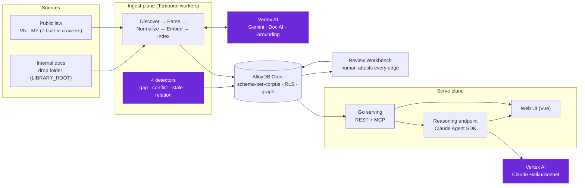

<!--
SPDX-License-Identifier: AGPL-3.0-only
Copyright (C) 2026 Danny Ota
-->

# mise

Evidence-only **regulatory & policy intelligence** for banks — ingest public law
(Vietnam, Malaysia) and internal controls, build a **compliance graph** with
AI-proposed, human-attested edges, detect gaps/conflicts/staleness, and answer
audit questions with **cited, grounded evidence**. mise never asserts compliance.

> Single-tenant. Bank-operated. Open source (AGPL-3.0).

## How it fits together

AI (violet) **proposes**; a grounding check gates every proposal; a **human attests** before
anything is served as a mapping. The read path serves verbatim, tier-gated evidence only.

## Getting started

1. **[Deploy](guides/deploy.md)** — `podman compose up -d` locally (zero GCP cost with
   `VERTEX=fake`), or GKE for production. All configuration is environment variables —
   the [table](guides/deploy.md#environment-variables) lists every one.
2. **[Ingest public law](guides/first-corpus.md)** — VN + MY crawlers are built in; trigger
   one Temporal workflow per corpus, nothing to configure.
3. **[Add internal documents](guides/graph-detectors.md)** — set `LIBRARY_ROOT`, drop files
   under `group-std/` · `local-policy/` · `local-sop/`, optional `.meta.json` sidecars for
   doc-control metadata. The graph and detectors run from there.
4. **[Ask audit questions](guides/audit-qa.md)** — cited, grounded answers over SSE; the
   agent abstains when evidence is insufficient.
5. **[Use the Web UI](guides/web-ui.md)** and **[operate it](guides/operations.md)** —
   review workbench, findings, dashboards; monitoring, backup, upgrades.

The [Overview](guides/overview.md) explains the product in five minutes.

## At a glance

| Layer      | Stack                                                                  |
| ---------- | ---------------------------------------------------------------------- |
| **Serve**  | Go + AlloyDB Omni (ScaNN) — fast, evidence-only read path              |
| **Reason** | Claude Agent SDK (Haiku 4.5 / Sonnet 4.6 on Vertex) — server-side only |
| **Ingest** | Temporal workers + Gemini 3.5 Flash + Doc AI + Check Grounding         |
| **Web**    | Vue 3.5 SPA (Vite + Tailwind 4)                                        |
| **Deploy** | Single-tenant GKE — one instance per bank, scale-to-zero               |

## Design

- [Architecture](design/ARCHITECTURE.md) — components, read/write planes, storage
- [Data model](design/DATA-MODEL.md) — schema, compliance graph, findings
- [AI governance](design/AI-GOVERNANCE.md) — model gates, agent guardrails
- [Data governance](design/DATA-GOVERNANCE.md) — access tiers, RLS, HITL
- [UI design](design/UI-DESIGN.md) — screens, stack, principles
- [API contract](design/API-CONTRACT.md) — REST + MCP + SSE

## Engineering

- [Toolchain](engineering/TOOLCHAIN.md) — Go 1.26, pnpm 11, golangci-lint v2
- [Folder structure](engineering/FOLDER_STRUCTURE.md) — monorepo layout
- [CI/CD](engineering/CI-CD.md) — pipeline + supply chain
- [Testing](engineering/TESTING.md) — pyramid, contract, eval, load
- [Deployment](engineering/DEPLOYMENT.md) — GKE runtime
- [Local dev](engineering/LOCAL-DEV.md) — Podman stack
- [Delivery model](engineering/DELIVERY-MODEL.md) — tenancy, upgrades
- [Observability](engineering/OBSERVABILITY.md) — tracing, metrics, SLOs
- [Threat model](engineering/THREAT-MODEL.md) — STRIDE, trust boundaries
- [Licenses](engineering/LICENSES.md) — dep inventory + CI gate

## Project

- [Roadmap](project/ROADMAP.md) — M0–M9 (all ✅)
- [Decisions](project/DECISIONS.md) — locked + open
- [Risks](project/RISKS.md) — delivery risk register
- [Cost](project/COST.md) — unit rates, build, recurring

## Meta

- [Doc style](DOC_STYLE.md) — how these docs are written
- [Changelog](/CHANGELOG.md)
