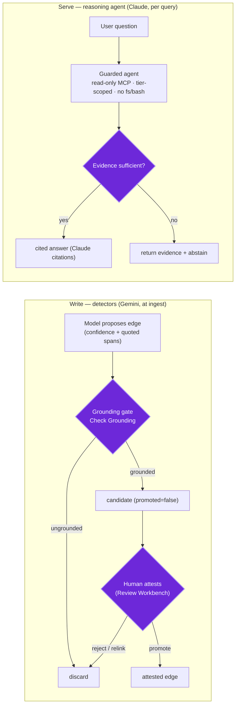
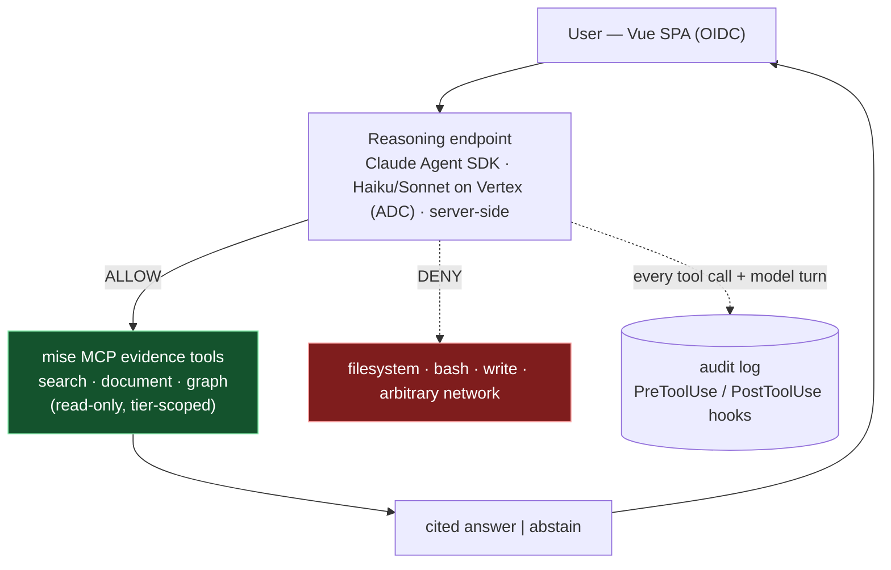

# Mise — AI Governance

How mise governs the **AI models and the user-facing AI agent** — distinct from
[DATA-GOVERNANCE.md](./DATA-GOVERNANCE.md), which governs _data_ (access, flow, audit).
This file governs the _models_: what they may do, how their output is grounded and
gated, who approves them, and how every AI action is traced.

See also: [ARCHITECTURE.md](./ARCHITECTURE.md) · [DATA-GOVERNANCE.md](./DATA-GOVERNANCE.md) ·
[DATA-MODEL.md](./DATA-MODEL.md) · [PLAN.md](../project/PLAN.md) ·
[DECISIONS.md](../project/DECISIONS.md).

---

## 1. 🧭 The invariant — AI proposes, evidence grounds, humans attest

mise **never lets a model assert compliance.** Every AI output is:

- **grounded** in retrieved verbatim evidence (not model memory),
- **gated** — machine output is a _candidate_ until it passes a grounding check and/or a
  human promotes it,
- **traceable** — model · prompt · inputs · grounding score · run_id are logged.

The AI is **decision support**, never the system of record. mise surfaces evidence and
proposals; humans decide.

---

## 2. 🤖 Two AI surfaces

| Surface                     | Models                                                       | Runs                       | Role                                                    |
| --------------------------- | ------------------------------------------------------------ | -------------------------- | ------------------------------------------------------- |
| **Write — detectors**       | Gemini 3.5 Flash (judge/extract) · Check Grounding · Ranking | ingest (Temporal), backend | propose relation edges; **never auto-promote**          |
| **Serve — reasoning agent** | Claude Haiku 4.5 / Sonnet 4.6 (Agent SDK)                    | per user query, backend    | retrieve evidence + compose **cited** answers for users |

Both run on **Vertex (ADC)** — one auth/governance boundary. **Neither runs in the
browser**; all model calls are server-side. Each surface's output must clear governance
**gates** before it is trusted:

The **gates** (violet) are the AI controls: write output clears a **grounding gate**
then a **human-attestation gate**; serve output clears a **sufficiency gate** (cite or
abstain). The human review _workflow + data recompute_ is owned by
[DATA-GOVERNANCE.md](./DATA-GOVERNANCE.md) §5 — this file owns the _gates_.

---

## 3. ⚖️ Model risk & approval (bank model-risk lens)

- **Model register.** Every model in use (id, version, provider = Vertex, purpose,
  owner) is recorded — aligns with BNM / SBV model-risk expectations (SR 11-7-style).
- **Change control.** Model id/version, prompts, embedding dims, `task_type`, and
  grounding thresholds are **versioned**; a change is a reviewed change, re-evaluated
  before rollout. The embedding model/dim is **LOCKED** (re-embedding cost).
- **Validation.** Per release, against the human-promoted golden set: cross-corpus
  **mapping precision/recall** plus the retrieval-side metrics inherited from the banhmi
  engine (recall@k · MRR@k · current-law precision · abstention · citation). Metric floors
  live in TESTING §5; golden set in DATA-MODEL §8.

---

## 4. 🤖 Write-path AI governance (the detectors)

- **Propose → verify → promote.** The Gemini judge proposes an edge with confidence +
  quoted spans; **Check Grounding** verifies the rationale is entailed by _both_
  verbatim texts; only grounded candidates enter the review queue; **a human promotes**
  — nothing is auto-attested.
- **Thresholds.** Confidence + grounding-support thresholds gate candidacy (tunable,
  logged).
- **Audit.** Each candidate records `run_id · model · prompt_hash · confidence ·
grounding_score · created_by(=system)`; promotion records
  `promoted_by (role+dept) · promoted_at · rationale`.
- Internal `implements` / `derives` edges are **extracted deterministically** (no
  model) — lower AI risk than the law-facing `satisfies` judge.

---

## 5. 🤖 Serve-path AI governance (the user-facing agent)

The Claude Agent SDK reasoning endpoint runs inside a **guardrail boundary** — it may
_read evidence_ and nothing else:

Controls, in detail:

- **Read-only, permission-gated tools.** Allow `mcp__mise__*` (search · document ·
  graph); **deny filesystem / bash / write**. The agent can only _read evidence_ — it
  cannot mutate the graph, files, or DB. Instructions embedded in documents cannot make
  it act.
- **Tier-scoped.** It calls mise under the **caller's access tier** (RLS); it never
  sees evidence the user can't.
- **Grounded answers + abstain.** Answers cite evidence via **Claude citations**; when
  evidence is insufficient the agent **returns the evidence and abstains** rather than
  guessing. It surfaces; it never certifies.
- **Per-turn audit.** Agent SDK **PreToolUse / PostToolUse hooks** log every tool call
  and model turn (model · inputs · cite-spans · caller · ts).
- **Bounds.** Handle model refusals; cap agent-loop iterations; bounded `max_tokens`.

> **What users may rely on:** the agent is **advisory** — a fast, cited reading of the
> evidence. A human verifies before any compliance decision; the agent never promotes
> edges and never asserts that a control _is_ satisfied.

---

## 6. ⚖️ Human-in-the-loop

The Review Workbench is where AI proposals become attested truth: a reviewer sees
**confidence + grounding + both verbatim texts**, then **promote / reject / relink**. A
relink re-triggers detection. Human-attested edges become the eval golden set.
(See [DATA-GOVERNANCE.md](./DATA-GOVERNANCE.md) §5.)

---

## 7. 🔒 Confidential text & the models (the AI gate)

Both AI surfaces send internal text to Vertex-hosted models — the write judge sees
policy/standard clauses; the serve agent sees retrieved evidence. Governance:

- **Open gate (DECISIONS 10 & 17):** may confidential internal text leave to Vertex
  at all (decision 10 — data terms), and **from / to which region** (decision 17 — VN
  Decree 53/2022 localization + Decree 13/2023 PDPD)? If yes (not used for training,
  region acceptable), this is the design. If no, self-host the stack (embedder + judge),
  and the serve agent moves to a self-hosted model too.
- **The serve agent adds no new exposure:** it only sees evidence already parsed and
  embedded at write time — no exposure category beyond the write path.
- **On-demand translation _is_ a new read-side exposure.** The cross-lingual "translate"
  toggle (UI-DESIGN §5) sends evidence text to the **Google Cloud Translation API** (a
  managed translate service, not the reasoning LLM) **on read**. For
  **public** corpora (vn-reg/my-reg) this is unproblematic; for **confidential tiers**
  (group-std/local-policy/local-sop) it is the **only** read-path touch that ships confidential
  text to a model, so it is **gated like the write path** (DECISIONS 10/17): allowed only
  under the same data/region terms, else disabled for confidential tiers or routed to a
  self-hosted translator. Translations are display aids (never the cited text) and cached
  by source-hash; the call is audited like any model turn (§9).

### The "no" branch — self-hosted AI variant (fallback design)

If the gate closes for confidential tiers (DECISIONS 10 "no", or 17 forces it on
residency), the Vertex models are replaced by **self-hosted, in-cluster** equivalents
behind the **same Go interface seam** (LOCAL-DEV §4). The data flow, the grounding/
attestation gates (§1/§4), and the audit (§9) are **unchanged** — only the model endpoints
move inside the perimeter, so the confidential-tier **Vertex egress (B4) disappears**
(THREAT-MODEL §3):

| Vertex touchpoint (default)        | Self-hosted replacement                                           | Seam                         |
| ---------------------------------- | ----------------------------------------------------------------- | ---------------------------- |
| `gemini-embedding-001`             | open embedder (lead **Qwen3-Embedding-8B**, MRL→1536) — DEC 10    | `pkg/rag/embed` interface    |
| Doc AI Layout Parser               | in-cluster OSS layout/OCR parser                                  | parser interface             |
| Gemini 3.5 Flash judge + Grounding | self-hosted instruct model + entailment check                     | judge / ground interface     |
| Claude serve agent (Agent SDK)     | self-hosted instruct model behind the **same** read-only MCP loop | reasoning-endpoint model cfg |

- **1536-d stays LOCKED** (§3): the fallback embedder must MRL/project to 1536, so the
  vector space is unchanged — a re-embed, not a re-architecture.
- The trade is usage-metered Vertex → **fixed in-cluster GPU compute**; sized at build
  phase if the branch fires (not in COST's default profile).
- **Owns only the swap map.** The trigger (data terms / residency) and the embedder
  bake-off are DECISIONS 10/17; the data-flow view is DATA-GOVERNANCE §3.

See [DATA-GOVERNANCE.md](./DATA-GOVERNANCE.md) §3 for the data-flow view of these
touchpoints.

---

## 8. ⚠️ Safety & prompt injection

- **Evidence is data, not instructions** — the agent treats retrieved text as content
  to cite, not commands to follow.
- The agent is **read-only** (§5), so even a successful injection cannot mutate state or
  exfiltrate beyond what the caller's tier already permits.
- **Tier / RLS filtering happens before** evidence reaches the model.

---

## 9. 📊 Audit & reproducibility (the model record)

Every AI action is reconstructable to the exact model, prompt, and evidence it used.
**This file owns the AI-side audit; data/access + human-decision audit is
[DATA-GOVERNANCE.md](./DATA-GOVERNANCE.md) §6.**

| AI event                                  | Recorded                                                                                                                        |
| ----------------------------------------- | ------------------------------------------------------------------------------------------------------------------------------- |
| Edge **proposed** (write judge)           | `edge_type · run_id · model · prompt_hash · confidence · grounding_score · created_by(=system)`                                 |
| Reasoning-endpoint **turn** (serve agent) | `caller · model (Haiku/Sonnet) · MCP tool calls + inputs · answer cite-spans · ts` — via Agent SDK PreToolUse/PostToolUse hooks |

The human _decision_ on a proposal (promote/reject/relink, by role+department) is the
attestation record — logged in DATA-GOVERNANCE §6.
