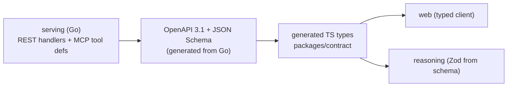

# Mise — API Contract

The surfaces `serving` exposes: **REST** (for the Vue web app), **MCP tools** (for the
reasoning endpoint and other agents), and **SSE** (the reasoning endpoint → web, Q&A
stream). This doc owns the _contract_; the components behind it are
[ARCHITECTURE.md](./ARCHITECTURE.md), the schema is [DATA-MODEL.md](./DATA-MODEL.md).

See also:

- [ARCHITECTURE.md](./ARCHITECTURE.md) §2/§6
- [DATA-MODEL.md](./DATA-MODEL.md)
- [DATA-GOVERNANCE.md](./DATA-GOVERNANCE.md) (tiers/RLS)
- [TESTING.md](../engineering/TESTING.md) §4 (contract test)
- [FOLDER_STRUCTURE.md](../engineering/FOLDER_STRUCTURE.md)

---

## 1. Shape & rules

- **`serving` (Go) is evidence-only and read-mostly.** REST + MCP return ranked evidence,
  graph, findings; the only writes are **human review actions** (promote/reject/relink,
  finding dispositions) — never model output (AI-GOVERNANCE §1).
- **Auth on every call:** OIDC bearer; the caller's **tier is resolved server-side** and
  bound to the DB session role (RLS). Clients never assert their own tier
  (DATA-GOVERNANCE §2/§7).
- **Tier propagation:** the reasoning endpoint calls MCP **as the user** — it forwards the
  caller's identity so MCP reads run under the user's tier, never the service's.
- **Read = evidence-only:** no endpoint composes an answer or asserts compliance; the
  reasoning endpoint does that, server-side, over these same MCP tools.

---

## 2. MCP tools (for the reasoning endpoint + agents)

Three **read-only** tools, namespaced `mcp__mise__*` (the allow-list in AI-GOVERNANCE §5).
All are tier-scoped; all return verbatim text + citation + provenance.

| Tool           | Input (core)                                                                        | Returns                                                                                                                   |
| -------------- | ----------------------------------------------------------------------------------- | ------------------------------------------------------------------------------------------------------------------------- |
| **`search`**   | `query` · `corpora[]?` · `top_k?` · `as_of_date?` · `in_force_only?` (default true) | ranked `sections[]` — `{corpus_id, document_id, section_id, citation_path, text, validity_status, score, source_url}`     |
| **`document`** | `corpus_id` · `document_id` (or `section_id`)                                       | full document/section metadata envelope (DATA-MODEL §2) + verbatim text + amendment timeline                              |
| **`graph`**    | `node_ref` · `direction` (up/down) · `edge_types[]?` · `depth?`                     | nodes + `relation_edge`s with `confidence`/`grounding_score`/`promoted`, and the control **chain** (SOP→Policy→Group→law) |

- **`search`** is validity-aware (in-force by default; `as_of_date` for historical) and
  hybrid (ScaNN + FTS, RRF) — the caller gets evidence, never a synthesized answer.
- No `write`, no `filesystem`, no `bash` — denied at the SDK permission layer (AI-GOVERNANCE §5).
- Tool **input schemas are JSON Schema** (the MCP-native contract) — the single source of
  truth in §5.

---

## 3. REST (for the web app)

Versioned under `/api/v1`. One row per screen (UI-DESIGN §2). `R`=read, `W`=human action.

| Method · Path                                                                  | Screen            | Notes                                                                                                                                                              |
| ------------------------------------------------------------------------------ | ----------------- | ------------------------------------------------------------------------------------------------------------------------------------------------------------------ |
| `GET /search`                                                                  | Graph/Q&A support | thin REST mirror of the MCP `search` tool                                                                                                                          |
| `GET /documents/{corpus}/{id}`                                                 | evidence view     | full metadata + verbatim + timeline                                                                                                                                |
| `GET /graph/nodes/{ref}` · `GET /graph/chain/{ref}`                            | Graph Explorer    | edges + the control chain                                                                                                                                          |
| `GET /dashboards/summary`                                                      | Dashboards        | coverage % · open conflicts · staleness · queue depth · ingest status                                                                                              |
| `GET /reviews?status=&sort=confidence`                                         | Review Workbench  | candidate edges + confidence + grounding + both texts                                                                                                              |
| `POST /reviews/{edge}/promote` · `/reject` · `/relink` `W`                     | Review Workbench  | writes `human_attested`; **relink re-triggers detection** (DATA-GOVERNANCE §5)                                                                                     |
| `GET /findings?kind=&status=`                                                  | Findings          | gap · conflict · staleness                                                                                                                                         |
| `GET /findings/{id}` · `POST /findings/{id}/resolution` `W`                    | Resolution        | disposition (map/document/accept/escalate) + owner (role+dept)                                                                                                     |
| `GET /timeline?from=&to=&corpus=`                                              | Change Timeline   | amendments in range → impacted policies/SOPs (derived, DATA-MODEL §10)                                                                                             |
| `GET /notifications` · `POST /notifications/{id}/read` `W`                     | Notifications     | per-user inbox + read state                                                                                                                                        |
| `GET /webhooks` · `POST /webhooks` · `DELETE /webhooks/{id}` `W`               | Notifications     | manage subscriptions (HMAC secret, tier-capped; endpoint egress policy = DECISIONS 19)                                                                             |
| `POST /reports/coverage` · `GET /reports/findings.xlsx`                        | Reports           | Coverage report (control chain + gaps) · Findings register export                                                                                                  |
| `POST /translate`                                                              | Cross-lingual     | on-demand evidence translation via **Google Cloud Translation API** (managed service, not the reasoning LLM) — **gated for confidential tiers** (AI-GOVERNANCE §7) |
| `POST /corpora` · `POST /corpora/{id}/ingest` · `GET /corpora/{id}/status` `W` | Corpus Admin      | register/trigger; Temporal workflow status                                                                                                                         |

The **Q&A chat is not REST** — it streams from the reasoning endpoint (§4).

---

## 4. SSE (Q&A chat)

- `POST /chat` on the **reasoning endpoint** (not `serving`) opens an **SSE** stream.
- Event types: `token` (answer delta) · `citation` (span → evidence ref) · `chain`
  (the control chain) · `evidence_checked` (grounding/support badge) · `abstain` ·
  `done` · `error`. Cancellable (client close → `AbortController`, CODE_STYLE_TS).
- The browser **only** talks to this endpoint over SSE — it never calls a model
  (AI-GOVERNANCE §5, UI-DESIGN §1).

---

## 5. Source of truth & generation

**Decision: `serving` (Go) owns the contract; types are generated outward — never
hand-mirrored.**

- Go is the **provider**, so it owns the schema; REST → **OpenAPI 3.1**, MCP tools →
  **JSON Schema** (MCP-native).
- Generate the TS types into **`packages/contract`**; `web` and `reasoning` import them —
  a provider change that isn't regenerated **breaks the consumer build** (the contract
  test, TESTING §4).
- This kills the drift risk FOLDER_STRUCTURE flagged: there is **one** schema, generated,
  not three hand-written copies.

---

## 6. Conventions

- **Errors:** RFC 9457 `application/problem+json` (`type · title · status · detail ·
instance`); typed, never bare strings.
- **Pagination:** cursor-based (`?cursor=&limit=`); evidence lists are ranked, so cursors
  encode rank position.
- **Idempotency:** review/resolution `POST`s take an `Idempotency-Key`.
- **Versioning:** path-versioned (`/api/v1`); the MCP tool set is versioned with the
  server; breaking changes bump both.
- **No raw query text in responses or logs** beyond what the caller sent (DATA-GOVERNANCE §6).
- **Webhooks** carry an HMAC signature + `finding_ref` + tier badge, **never confidential
  content** (DATA-GOVERNANCE §8).
- **`/translate` is gated:** confidential-tier text is refused unless the AI gate permits it
  (AI-GOVERNANCE §7); public-corpus text always allowed; results cached by source-hash.

---

## 7. Contract Packaging

- The reference edge contract is **REST/JSON + MCP JSON Schema + SSE**. If connect-go is used
  internally, it must stay behind the same generated REST/MCP contract.
- OpenAPI is **generated from Go**; no spec-first stubs.
- `packages/contract` publishes the generated REST types plus the **MCP tool schemas and
  descriptions** so `web`, `reasoning`, and external agents discover the same surface.
