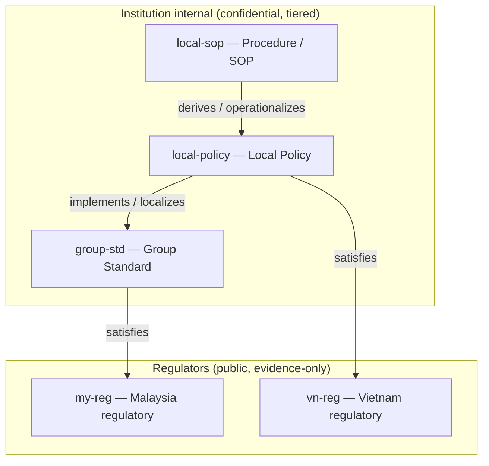
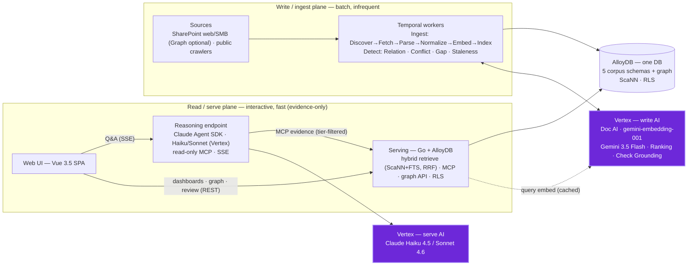
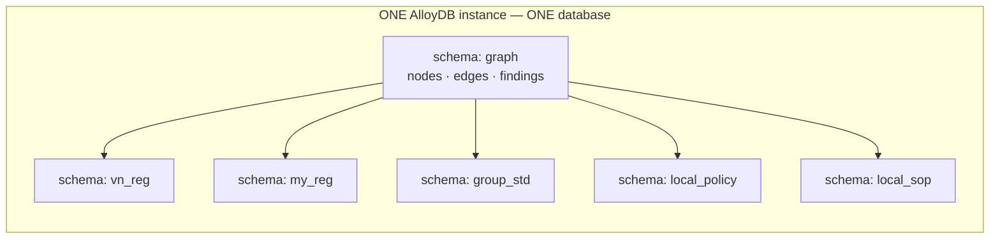
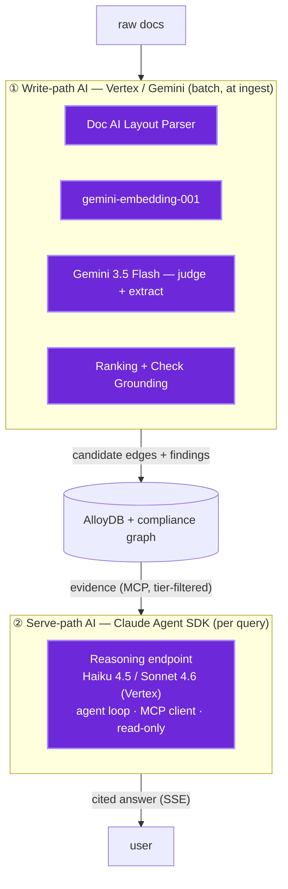
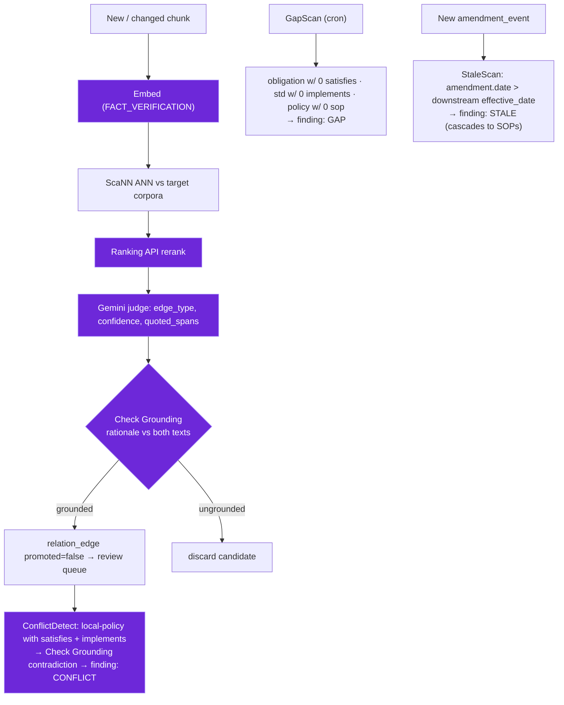
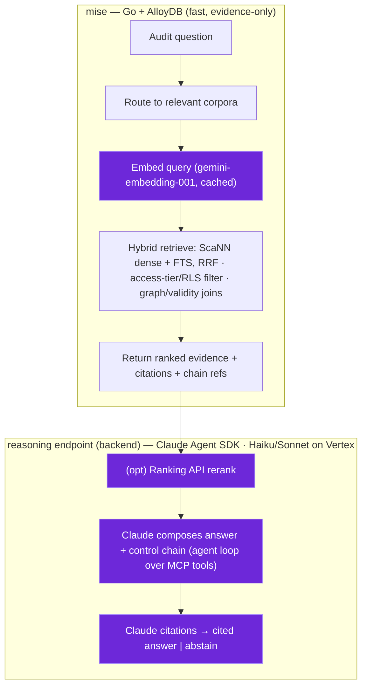

<!--
SPDX-License-Identifier: AGPL-3.0-only
Copyright (C) 2026 Danny Ota
-->

# Mise — Architecture

Evidence-only regulatory & policy intelligence for **banks**, spanning
Vietnamese and Malaysian banking regulation, and an institution's own internal control
documents (Group standards, local policies, SOPs).
Built on the proven evidence-only regulatory-RAG engine behind **banhmi** (Vietnam) and
**laksa** (Malaysia) — Temporal + Postgres/pgvector + medallion ingestion + evidence-only
MCP, **itself open source** ([`dannyota/banhmi`](https://github.com/dannyota/banhmi),
Apache-2.0 — mise **reuses and improves** it, same author, from public source,
consistent with the self-host delivery model) — upgraded with **enterprise tech** (AlloyDB Omni +
ScaNN) and Vertex AI on the **write path** (parsing, embedding, edge-judging,
grounding), and extended with a cross-corpus **compliance graph**, an
**AI detection layer**, and a model-driven **reasoning endpoint** + **Web UI**.

**Deployed single-tenant, per enterprise:** one mise instance runs **in each bank's own GCP
project** (bank-operated; open source — the bank self-hosts from public source). The whole
stack sits inside the bank's perimeter, and Vertex is the bank's own GCP Vertex — so the bank
owns the confidentiality and region configuration. Delivery & operating model:
[DELIVERY-MODEL.md](../engineering/DELIVERY-MODEL.md); runtime:
[DEPLOYMENT.md](../engineering/DEPLOYMENT.md); threat view:
[THREAT-MODEL.md](../engineering/THREAT-MODEL.md).

See also:

- [DATA-GOVERNANCE.md](./DATA-GOVERNANCE.md) (data flow · access · audit)
- [AI-GOVERNANCE.md](./AI-GOVERNANCE.md) (model use · grounding · HITL)
- [UI-DESIGN.md](./UI-DESIGN.md) (Web UI)
- [DATA-MODEL.md](./DATA-MODEL.md) (metadata · relations)
- [PLAN.md](../project/PLAN.md) (build-plan index)
- [DECISIONS.md](../project/DECISIONS.md) (decision log)
- [COST.md](../project/COST.md) (cost model)
- [API-CONTRACT.md](./API-CONTRACT.md) (surfaces)
- [TOOLCHAIN.md](../engineering/TOOLCHAIN.md)
- [CI-CD.md](../engineering/CI-CD.md)
- [OBSERVABILITY.md](../engineering/OBSERVABILITY.md)
- [TESTING.md](../engineering/TESTING.md)

---

## 0. Operating principle — evidence-only engine, read-fast; reasoning at the endpoint

mise is an **enterprise upgrade** of that engine, keeping its core discipline:
**fast, evidence-only reads**. The serving path is **Go + AlloyDB Omni only** —
hybrid retrieval (ScaNN dense ANN + full-text, RRF-fused) with **access-tier/RLS
filtering** and graph/validity joins, returning ranked evidence + citations in
milliseconds. mise **never reasons, LLM-ranks, or asserts compliance** on the hot
path.

**Reasoning lives at the endpoint — a backend service, never the browser.** The
**reasoning endpoint** is a server-side **Claude Agent SDK** service running **Claude
Haiku 4.5 / Sonnet 4.6 on Vertex** (ADC); it consumes mise's fast MCP evidence tools
(read-only, permission-gated) and _decides what to do_: rerank, compose a cited answer,
walk the graph — streaming to the **Vue SPA** over SSE. Model calls stay server-side
(audited via Agent SDK hooks). Vertex's heavy _write_ work (parse · embed-docs · judge
edges · grounding) runs at ingest with **Gemini 3.5 Flash** + the Google stack; the
main Vertex touch on read is embedding the user's query into the shared
`gemini-embedding-001` space — **cached** (DECISIONS 1). The one other optional
read-side model touch is **on-demand translation** of evidence for display (cross-lingual
UX) via the **Google Cloud Translation API** — a managed translate service, **not** the
reasoning LLM; a display aid, gated for confidential tiers (§3, AI-GOVERNANCE §7).

---

## 1. The 5 corpora (extensible)

Five corpora spanning two public regulatory knowledge bases and three tiers of internal control
documents — see [DATA-MODEL §1](./DATA-MODEL.md) for the full table (id, content, source, citation
scheme, access tier).

> Scope note: the law corpora cover **all banking regulation**, not just the
> digital/technology subset that today's digital/technology indexes carry. See
> COST.md for the volume impact.
>
> Source connectors (the real ingest sources per corpus, e.g. `vbpl.vn`,
> `congbao.chinhphu.vn`, `lom.agc.gov.my`, `bnm.gov.my`): see
> [DATA-MODEL.md](./DATA-MODEL.md) §1.

### Authority / derivation DAG



Edges point from a document to the authority it is evidence for; reverse the arrow
to read derivation (top-down). All corpora share one embedding model + dims.

---

## 2. System architecture

**Two planes meet at one database.** The **read/serve plane** is interactive and
evidence-only; the **write/ingest plane** is batch. Write-AI is Gemini, serve-AI is
Claude — both on Vertex.



| Component                                                           | Responsibility                                                                                                                                                                                                                                     |
| ------------------------------------------------------------------- | -------------------------------------------------------------------------------------------------------------------------------------------------------------------------------------------------------------------------------------------------- |
| **Web UI** (Vue SPA)                                                | dashboards · Graph Explorer · Review Workbench · Q&A chat · admin — **never calls a model** ([UI-DESIGN.md](./UI-DESIGN.md))                                                                                                                       |
| **Reasoning endpoint** (separate **TS** service · Claude Agent SDK) | the only AI on read — agent loop over MCP evidence tools → cited answer / abstain; streams via SSE (§6)                                                                                                                                            |
| **Serving** (Go + AlloyDB)                                          | evidence-only retrieval: hybrid ScaNN+FTS / RRF, access-tier RLS, graph + validity joins; exposes REST + MCP                                                                                                                                       |
| **Notifications & reporting** (Go)                                  | fan out finding events → in-app · email · **webhook** (reference + tier, never confidential payload); generate **Coverage report** + **Findings register (Excel)**; serve the **Change Timeline** impact query ([UI-DESIGN.md](./UI-DESIGN.md) §5) |
| **AlloyDB**                                                         | one instance / DB — 5 corpus schemas + `graph` schema; ScaNN; RLS per tier                                                                                                                                                                         |
| **Sources + Temporal workers**                                      | batch ingest (medallion) + the 4 cross-corpus detectors                                                                                                                                                                                            |
| **Write AI** (Vertex/Gemini)                                        | parse · embed · judge · ground, at ingest (§3)                                                                                                                                                                                                     |
| **Serve AI** (Vertex/Claude)                                        | the reasoning endpoint's model (§3)                                                                                                                                                                                                                |

### Storage layout

**One AlloyDB instance, one database, schema-per-corpus** + a `graph` schema:



**Schema-per-corpus** (not database-per-corpus) because the graph + detectors run
cross-corpus **JOINs** — separate databases can't cross-join without `postgres_fdw`.
Confidentiality is **roles + row-level security per schema**, which preserves the joins
(unlike DB-level isolation). Why AlloyDB over Vertex Vector Search / plain pgvector:
DECISIONS 4 · COST.md.

---

## 3. AI components

mise has exactly **two AI subsystems** — both on Vertex (ADC), both server-side, never
in the browser:



| Subsystem           | Models                                                                              | When           | Role                                                                    |
| ------------------- | ----------------------------------------------------------------------------------- | -------------- | ----------------------------------------------------------------------- |
| **① Write-path AI** | Doc AI Parser · gemini-embedding-001 · Gemini 3.5 Flash · Ranking · Check Grounding | ingest (batch) | parse · embed · **propose** relation edges, verify — never auto-promote |
| **② Serve-path AI** | Claude **Haiku 4.5** / **Sonnet 4.6** via the Agent SDK                             | per user query | retrieve evidence + compose **cited** answers (read-only agent)         |

**Hard constraint (LOCKED):** every corpus embeds with `gemini-embedding-001` @
**`output_dimensionality = 1536`** — one comparable vector space (changing it ⇒
re-embed everything).

> Governance of these models — grounding gate, abstain, approval, audit, HITL:
> [AI-GOVERNANCE.md](./AI-GOVERNANCE.md); the serve agent's guardrail boundary is §5.
>
> **Optional display aid (not a third subsystem):** cross-lingual UX may call the **Google
> Cloud Translation API** (a managed translate service) on read to render evidence in the
> user's language. It never grounds, ranks, or composes — the verbatim source stays
> authoritative. Translating
> **confidential-tier** text is a _new_ read-side model exposure, so it follows DECISIONS 10/17
> and the bank-owned Vertex controls (AI-GOVERNANCE §7); public-corpus text is unaffected.
> Results are cached by source-hash.

---

## 4. Compliance graph (the spine)

A `graph` schema in the shared AlloyDB instance is the **only** place the corpora
join — each stays pure evidence-only. **Nodes** reference a corpus
`(corpus_id, document_id, section_id)`; typed **edges**
(`satisfies · implements · derives · covers`) carry evidence (confidence, grounding,
rationale, full audit trail) behind a **promote gate** (machine candidate →
human-attested); **findings** (`gap · conflict · staleness`) hang off the graph +
document metadata.

> Authoritative node/edge/evidence/finding **schema**, the edge taxonomy, and the
> per-edge detection method live in [DATA-MODEL.md](./DATA-MODEL.md).

---

## 5. The 4 detectors (Temporal workflows)

> Write-path data flow + the human review/relink/re-trigger loop:
> [DATA-GOVERNANCE.md](./DATA-GOVERNANCE.md). Per-edge detection method + how
> confidence/grounding are computed: [DATA-MODEL.md](./DATA-MODEL.md) §5.



Internal edges (`implements`, `derives`) are **extracted during Normalize** from
the doc-control header — no judge needed when explicit. Only law-facing
`satisfies` edges run the full propose→verify→promote loop. ConflictDetect on the
Group-standard vs VN/MY-law pair is the crown jewel.

---

## 6. Reasoning endpoint (AI on read) — Audit Q&A

The **reasoning endpoint** is the _only_ place AI runs on the read path — a **separate
server-side TypeScript service** (Node 24 LTS + Hono) on the **Claude Agent SDK**, running
Claude **Haiku 4.5** (default) / **Sonnet 4.6** (hard cases) on Vertex via ADC. It:

- connects to mise's **MCP evidence tools** as a client — **read-only** (search ·
  document · graph; no filesystem/bash);
- runs the **agent loop**: retrieve → (opt) Ranking-API rerank → compose → cite;
- grounds answers with **Claude citations** over the returned evidence, and **abstains**
  when evidence is insufficient;
- **streams** to the Vue SPA over SSE; model calls stay server-side, never the browser.

mise itself **serves evidence, not answers** — the hot path (below) is Go + AlloyDB and
returns ranked, cited evidence in milliseconds; the endpoint decides what to do with it.



The endpoint may stop at evidence (evidence-only) or go on to compose a grounded
answer. When it composes, the chain it can build from mise's evidence:

```
"Control: SOP-12 ▸ POL-001 ▸ Group Tech Risk Std v3 ▸ BNM RMiT 10.x ▸ SBV TT 09/2020 Điều 7
 [each step links verbatim text + source]. Evidence checked: support 0.92."
```

mise exposes the **evidence tools** as REST (for the UI) and as MCP tools (for the
reasoning endpoint and other agents). The endpoint's governance — grounding gate,
abstain policy, model approval, permission-gating, and per-turn audit — is in
[AI-GOVERNANCE.md](./AI-GOVERNANCE.md).

---

## 7. Web UI

A **Vue 3.5 SPA** (Vite). Screens, stack, and design
principles live in **[UI-DESIGN.md](./UI-DESIGN.md)**. Architecturally: it hits the Go
serving API (REST) and the reasoning endpoint (SSE) under OIDC, and **never calls a
model directly** ([AI-GOVERNANCE.md](./AI-GOVERNANCE.md) §5).

---

## 8. Scale — corpus registry & multimodal

A corpus is a descriptor; adding one needs only a descriptor + source plugin +
scope seed — no core change. See [DATA-MODEL §9](./DATA-MODEL.md) for the full descriptor
shape (`corpus := { id, kind, source_plugin, embed{…}, access_tier, graph_role{…}, … }`).

- **Reports** (audit/risk): a corpus whose nodes _map into_ the graph (finding →
  obligation/policy it concerns) — turns the graph into a living audit map.
- **Diagrams/images**: Layout Parser verbalizes figures + tables; Gemini vision
  captions; embed the caption text (locked 1536-d space), keep the image ref. Native
  image vectors (e.g. `gemini-embedding-2`) are barred to preserve the single-space
  invariant (DECISIONS 1).
- Same embedding model + dims for every corpus (the one hard rule).
- **GA guard** (M6): `pkg/corpus/ga_guard_test.go` proves a fixture corpus registers by
  descriptor alone with zero core file changes. `Register` validates embed-space match
  (fail-closed) and rejects duplicates. `CheckGraphRole` enforces `CanSource`/`CanTarget`
  at edge write time. The registry admin surface (`GET /registry`, `GET /registry/{id}`)
  exposes all descriptors and the generated OpenAPI contract stays in sync.

---

## 9. Tech stack

The runtimes; **deployment mechanics live in [DEPLOYMENT.md](../engineering/DEPLOYMENT.md)**, the local
stack in **[LOCAL-DEV.md](../engineering/LOCAL-DEV.md)**, versions in [TOOLCHAIN.md](../engineering/TOOLCHAIN.md).

- **Backend:** Go (**reuses + improves** the banhmi/laksa engine — same author);
  **Temporal self-hosted** (server + Go workers); **AlloyDB Omni** (with ScaNN), ~2 vCPU — one
  instance/database,
  schema-per-corpus + `graph` schema, RLS; GCS (raw files), Secret Manager.
- **Vertex AI (write path):** Document AI Layout Parser, `gemini-embedding-001`,
  Gemini 3.5 Flash (judge/extract), Ranking API, Check Grounding.
- **Reasoning endpoint (serve path) — a _separate_ TypeScript service:** **Node 24 LTS +
  Hono**, the **Claude Agent SDK** (`@anthropic-ai/claude-agent-sdk`) running **Claude
  Haiku 4.5 / Sonnet 4.6 on Vertex** (`CLAUDE_CODE_USE_VERTEX=1` + ADC). MCP client to
  mise's evidence tools (**read-only + permission-gated**, no fs/bash); **`jose`** verifies
  the caller's OIDC token → tier propagated on every MCP call; **Zod** tool schemas;
  PreToolUse/PostToolUse **hooks → `pino` audit**; streams to the SPA over SSE. (Why a
  separate TS service / why the Agent SDK: DECISIONS 5.)
- **API:** Go HTTP via **huma v2 on chi** (DEC 23); SSE for chat; MCP servers per corpus
  ([API-CONTRACT.md](./API-CONTRACT.md)).
- **Web:** **Vue 3.5 SPA (Vite)**
  ([UI-DESIGN.md](./UI-DESIGN.md)).
- **Auth:** OIDC/IAM; per-corpus access tier; query-time classification filter; internal
  MCPs + UI are access-controlled (NOT public, unlike the public regulatory KBs).
- **Containers:** **Podman/Buildah** build the per-service `Containerfile`s (CI-CD §3).

---

## 10. Deployment & local development

- **Production (GKE):** **single-tenant — one instance per enterprise, in the bank's own GCP
  project, bank-operated** (open source; the bank builds + self-hosts); one cluster, no HA, auto
  scale-down, backup/DR, ingest connector ops — **[DEPLOYMENT.md](../engineering/DEPLOYMENT.md)**.
- **Local (laptop):** the full stack on **Podman**, separated from GKE, with a `VERTEX=real|fake`
  seam — **[LOCAL-DEV.md](../engineering/LOCAL-DEV.md)**.
