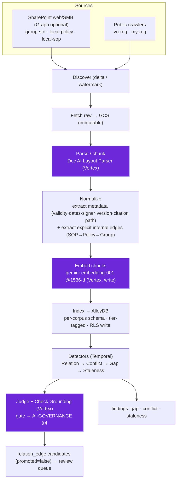
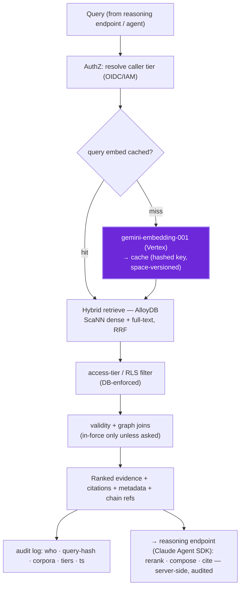
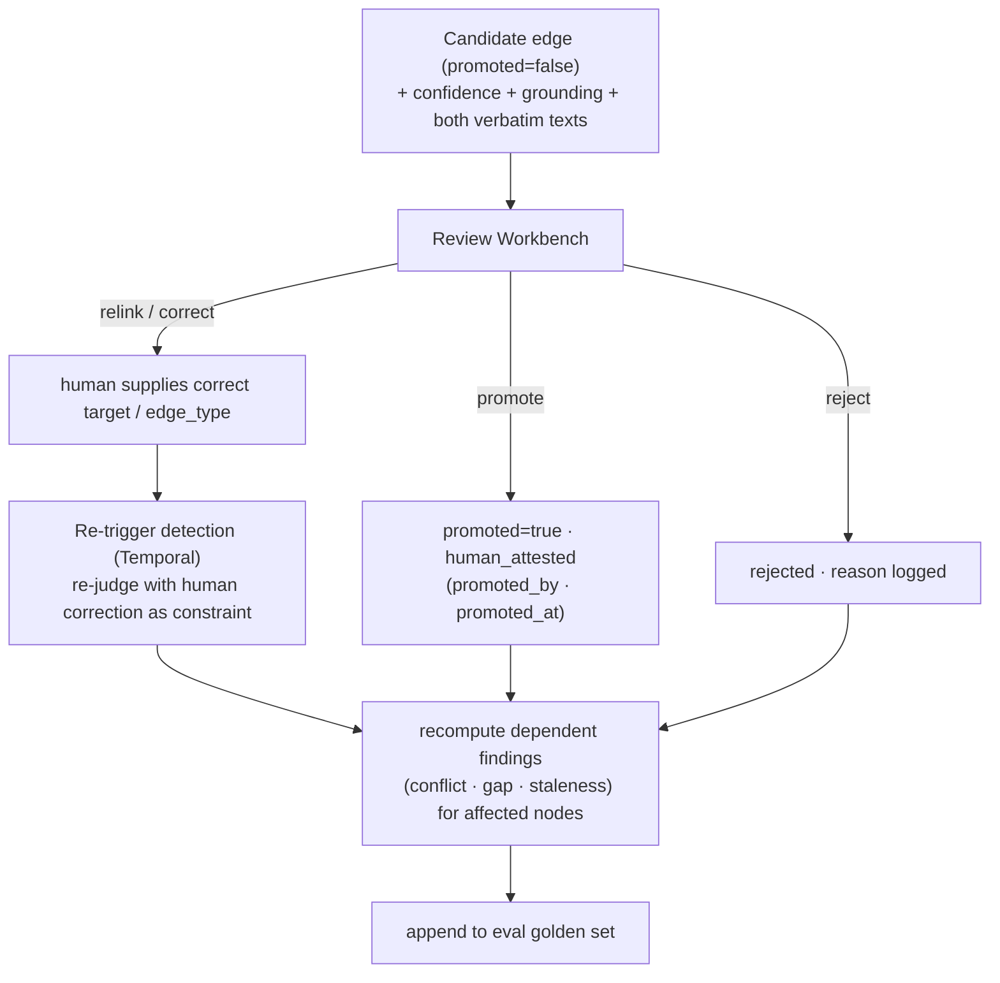

# Mise — Data Governance

How mise handles data: the **read** and **write** paths, the **access tiers** that
gate them, the **evidence-only** guarantee, the **human-in-the-loop** feedback loop,
and the **audit trail** behind every machine proposal and human decision.

See also:

- [ARCHITECTURE.md](./ARCHITECTURE.md) (system design)
- [AI-GOVERNANCE.md](./AI-GOVERNANCE.md) (model use · grounding · HITL)
- [DATA-MODEL.md](./DATA-MODEL.md) (metadata + relation schema)
- [PLAN.md](../project/PLAN.md)
- [DECISIONS.md](../project/DECISIONS.md)
- [COST.md](../project/COST.md)

---

## 1. Governance posture (the three guarantees)

1. **Evidence-only.** mise never _asserts_ compliance. It serves verbatim evidence,
   machine-proposed edges, and human-attested findings. Any answer or edge that
   would go beyond the evidence is gated (Check Grounding) or left to a human.
2. **Access-tiered.** Every corpus carries an access tier; every read is filtered by
   the caller's clearance at the database (RLS), not just in the UI.
3. **Fully audited.** Every human action and data event is recorded here (§6); every
   model proposal/turn is recorded in [AI-GOVERNANCE.md](./AI-GOVERNANCE.md) §9 —
   together, any edge or answer traces back to its source text, its model, and its
   human decider.

---

## 2. Access tiers & classification

| Tier                   | Corpora                     | Who can read                  | Enforcement                                              |
| ---------------------- | --------------------------- | ----------------------------- | -------------------------------------------------------- |
| **public**             | `vn-reg`, `my-reg`          | all authenticated users       | —                                                        |
| **group-confidential** | `group-std`                 | group + local cleared roles   | Postgres **RLS** on `group_std` schema                   |
| **local-confidential** | `local-policy`, `local-sop` | local (VN) cleared roles only | Postgres **RLS** on `local_policy` / `local_sop` schemas |

- Classification is assigned **at ingest** (write path) and travels with every node,
  chunk, edge, and finding.
- Enforcement is at the **database**: roles + **row-level security** per schema, so a
  cross-corpus join can only surface rows the caller is cleared for. The UI filter is
  a convenience on top, never the boundary.
- The graph is the only place corpora join; an edge inherits the **stricter** tier of
  its two endpoints (e.g. a `local-policy → my-reg` edge reads as local-confidential).

---

## 3. Write path (ingest) — where AI runs, where confidential text flows

Indexing is infrequent and batch (workers scale to zero between runs). This is the
**only** path where Vertex AI sees document text and where data is mutated.

**Vertex AI touchpoints on write (these see document text):**

| Step   | Vertex component       | Sees                            | Tier exposure                      |
| ------ | ---------------------- | ------------------------------- | ---------------------------------- |
| Parse  | Doc AI Layout Parser   | full document                   | incl. confidential internal docs   |
| Embed  | `gemini-embedding-001` | each chunk                      | incl. confidential chunks          |
| Judge  | Gemini 3.5 Flash       | clause pairs (law-facing edges) | policy/standard text vs public law |
| Ground | Check Grounding        | rationale + both texts          | as above                           |

> **These touchpoints are the only place confidential internal text reaches a model** (a
> data-flow fact). Decisions 10 and 17 allow the bank's own Vertex for the reference data class:
> regulation + internal control documents, not customer/user datasets. The self-hosted stack is
> an adopter-policy variant: [AI-GOVERNANCE.md](./AI-GOVERNANCE.md) §7. The **read** path adds no
> new exposure.

**Audit written at ingest (data provenance):** every chunk records `source_url ·
source_system · content_type · ingest_run_id · observed_at · access_tier`. The
_model-side_ fields on a candidate edge (`model · prompt_hash · grounding_score`) are
the **AI** record — [AI-GOVERNANCE.md](./AI-GOVERNANCE.md) §9.

---

## 4. Read path (serve) — evidence-only, fast, no mutation

The hot path is **Go + AlloyDB only**. It never writes, never calls an LLM, and the
single Vertex hop (query embedding) is **cached**. Reasoning runs at the **reasoning
endpoint** — a separate backend **Claude Agent SDK** service (Haiku/Sonnet on Vertex),
never in the browser.

**Read-path governance properties:**

- **No new confidential exposure by default.** The standing Vertex call embeds the _query
  string_ (cached); document text never leaves the DB on read. **Exception:** the optional
  cross-lingual **translate** action ships evidence text to the **Google Cloud Translation
  API** (a managed translate service, not the reasoning LLM) on demand —
  unproblematic for public corpora, allowed for confidential tiers under the bank-owned Vertex
  posture (AI-GOVERNANCE §7; DECISIONS 10/17), and disable-able by adopter policy. It is the
  only read action that can export confidential text.
- **Tier filtering is DB-enforced** (RLS), so a join across corpora cannot leak rows
  the caller can't see — even through the graph.
- **Validity-aware by default:** retrieval returns **in-force** evidence unless the
  caller explicitly asks for historical/as-of state (see DATA-MODEL validity model).
- **Reads are logged** (caller, query hash, corpora/tiers touched, timestamp) — never
  the raw query text (queries may carry sensitive terms; store a hash).
- **Evidence-only:** mise returns evidence; it does not compose or assert. The
  **reasoning endpoint** (backend Claude Agent SDK) composes the answer from it. Its AI
  controls — server-side model calls, read-only/permission-gated tools, Claude-citation
  grounding, abstain, per-turn hook audit — are [AI-GOVERNANCE.md](./AI-GOVERNANCE.md) §5.

---

## 5. Human-in-the-loop — review, relink, re-trigger

Machine-proposed edges are **candidates** (`promoted=false`) until a human acts. The
Review Workbench is where confidence is checked and corrections feed back.

- **Confidence is surfaced**, not hidden: each candidate shows judge confidence + the
  Check Grounding support score; the queue is filterable/sortable by confidence.
- **Relink = correction with feedback.** When a human fixes the target or edge type,
  the correction is recorded as `human_attested` evidence **and** re-triggers
  detection for the affected nodes (re-judge constrained by the human input), then
  **recomputes** the findings that depend on those edges.
- **Everything is audited:** promote/reject/relink record the actor, timestamp, and
  rationale. Human-attested edges become the **golden set** that measures mapping
  precision/recall over time.

---

## 6. Audit trail (data & access events)

| Event                           | Recorded                                                                                |
| ------------------------------- | --------------------------------------------------------------------------------------- |
| Chunk indexed                   | `source_url · source_system · content_type · ingest_run_id · observed_at · access_tier` |
| Edge promoted/rejected/relinked | `promoted_by (role + department) · promoted_at · decision · rationale`                  |
| Finding raised                  | `kind · severity · status · node_refs · evidence · detected_at`                         |
| Read served                     | `caller · query_hash · corpora · tiers · result_count · ts` (no raw query text)         |

> **Model-side audit** — what a model _proposed_ (edge) and each reasoning-endpoint
> _turn_ — is recorded in [AI-GOVERNANCE.md](./AI-GOVERNANCE.md) §9.

---

## 7. Authentication & secrets

- **AuthN/Z:** OIDC / IAM at the endpoint and the serving API; the caller's tier is
  resolved per request and bound to the DB session role (drives RLS).
- The internal MCP servers + Web UI are **access-controlled** — not public.
- **Secrets** (the crawler's **AD service-account** creds / SMB creds — or an Azure AD app
  if Graph is used — plus DB creds) in Secret Manager; raw files in GCS with immutable,
  tier-scoped buckets.

## 8. Notification egress

Findings notify officers over **in-app · email · webhook** (UI-DESIGN §5). The egress rule:

- **Webhooks carry a reference + tier badge, never confidential content** — the payload is
  a finding id + link; the receiver fetches detail under its own auth/RLS. A misconfigured
  webhook can't leak policy/SOP text. Endpoint egress restrictions are locked separately in
  DECISIONS 19 before webhook delivery is enabled beyond internal-only targets.
- **Email** to cleared recipients may include a summary, not verbatim confidential clauses;
  high-severity is immediate, the rest digested.
- Notification dispatch is audited (`finding · channel · recipient/endpoint · ts`).

## 9. Retention & erasure

Retention is **per layer**, set by bank policy. mise does **not** ingest customer/user datasets;
the only identifiable fields are bank-internal corporate contact metadata needed for document
accountability, anchored to **`(department, role)`** (DATA-MODEL §2).

| Layer                                                         | Retention                                                                                                                     | Erasure / lifecycle                                                                                                |
| ------------------------------------------------------------- | ----------------------------------------------------------------------------------------------------------------------------- | ------------------------------------------------------------------------------------------------------------------ |
| **Audit tables** (reads, attestations, findings, model turns) | append-only, immutable; retained per the bank's regulatory retention policy (banking audit horizons are long — set at deploy) | not user-erasable (compliance record); no customer/user data; accountability anchored to role+dept                 |
| **Raw files (GCS)**                                           | system of record; object-versioned, tier-scoped                                                                               | superseded versions age out by a bucket lifecycle rule; a withdrawn source doc is tombstoned, not silently dropped |
| **DB rows + embeddings (AlloyDB)**                            | live working set; **rebuildable** from GCS by re-ingest/re-embed                                                              | deleting a source cascades to its sections/edges/findings; embeddings are derived, never the system of record      |
| **Translation cache**                                         | display aid, keyed by source-hash                                                                                             | evictable any time; never authoritative (AI-GOVERNANCE §7)                                                         |

- **Corporate contact metadata.** Internal-doc authorship (`signer_name`, `author_name`,
  `owner_current_holder`, `holder_email`) and human attestations (`promoted_by`) are bank-internal
  accountability fields, not customer PII. The durable anchor is the **role**, so a leaver/mover
  update resolves through the **`org_role` resolver** (DATA-MODEL §2) while the role→document
  chain and the append-only `org_role_history` (for as-of audit) stay intact.
- **Region choice.** The adopter pins GCS, AlloyDB, Vertex, and backups to its selected GCP
  region(s) in deploy config (DECISIONS 17); this is not a project decision.
- **Backups inherit the tier.** DR backups (DEPLOYMENT §3) are tier-scoped and retained on
  the same policy; the irreplaceable graph/attestations are backed up first.
