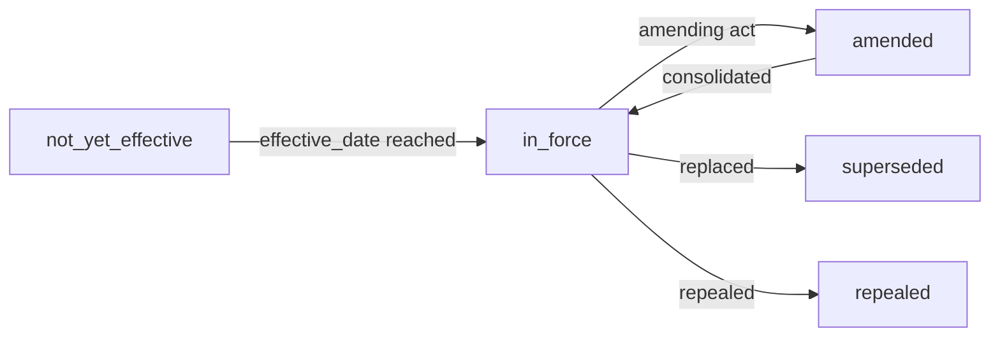
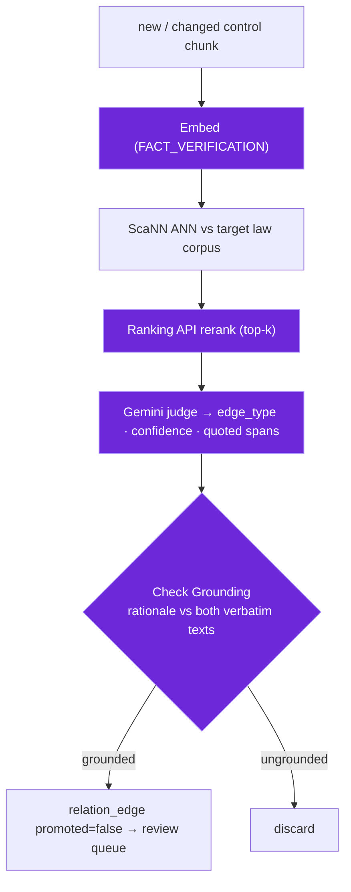

# Mise — Data Model

mise treats three things as first-class and equally important: **content** (verbatim
text), **relations** (the compliance graph linking controls to the authorities they
satisfy), and **metadata** (validity, dates, authorship, version, provenance). This
file specifies all three and the **control-detection** logic that builds the graph.

See also:

- [ARCHITECTURE.md](./ARCHITECTURE.md)
- [DATA-GOVERNANCE.md](./DATA-GOVERNANCE.md) (data flow + access)
- [AI-GOVERNANCE.md](./AI-GOVERNANCE.md) (model use · grounding)
- [PLAN.md](../project/PLAN.md)
- [COST.md](../project/COST.md)

---

## 1. The five corpora

| id             | content                           | source                | citation scheme     | access tier        |
| -------------- | --------------------------------- | --------------------- | ------------------- | ------------------ |
| `vn-reg`       | Vietnam regulatory (all banking)  | VBPL · Công Báo · SBV | Điều/Khoản/Điểm     | public             |
| `my-reg`       | Malaysia regulatory (all banking) | AGC LoM · BNM · SC    | Part/Section/Subsec | public             |
| `group-std`    | Group Standards                   | SharePoint (web/SMB)  | Standard/Clause     | group-confidential |
| `local-policy` | Local Policies                    | SharePoint (web/SMB)  | Policy §            | local-confidential |
| `local-sop`    | Local Procedures/SOPs             | SharePoint (web/SMB)  | SOP step            | local-confidential |

**Tiers & jurisdiction.** Internal control docs sit in two **tiers** — **Group**
(`group-std`, set at the parent/home level) and **Local** (`local-policy`, `local-sop`, the
operating entity). **Jurisdiction is an attribute, not part of the tier name:** `local-*`
carry their host `jurisdiction` (`vn` in the reference deployment); `group-std` carries the
**home** jurisdiction (`my` there); the regulators are jurisdiction-keyed (`vn-reg`,
`my-reg`). `satisfies` maps **by jurisdiction** — Local → host regulator
(`local-policy → vn-reg`), Group → home regulator
(`group-std → my-reg`). Adding another operating entity is just a new `local-*` corpus with a
different `jurisdiction` — no rename, no new tier (the "Group/Regional" trap avoided).

**Source connectors** (grounded in the banhmi/laksa engine's `pkg/ingest/*` — what each
corpus actually pulls from):

- `vn-reg` _(served by the **banhmi** KB)_: **VBPL** (`vbpl.vn` — Ministry of Justice
  national legal database) · **Công Báo** (`congbao.chinhphu.vn` — official Government
  gazette) ·
  **SBV** (`sbv.gov.vn` — State Bank of Vietnam portal) · also the Government
  legal-documents portal (`vanban.chinhphu.vn`).
- `my-reg` _(served by the **laksa** KB)_: **AGC — Laws of Malaysia** (`lom.agc.gov.my` —
  Federal Acts + P.U. subsidiary legislation) · **BNM** (`bnm.gov.my` — Bank Negara policy
  documents &
  guidelines) · **SC** (`sc.com.my` — Securities Commission Malaysia).
- `group-std` · `local-policy` · `local-sop`: internal control docs behind a **pluggable
  `ingest.Source`** — all feeding the same Normalize/metadata pipeline. **Where no Azure AD
  app is provisioned for Graph (often the case — it carries setup cost and a security
  sign-off), the practical default is the authenticated web crawl**; Graph is an optional
  upgrade where it is available:
  1. **Authenticated SharePoint web crawl** _(common default)_ — sign in with an **AD
     account** and crawl the intranet site's pages/document libraries (HTML + file download);
     no app registration, no extra spend.
  2. **SMB file-share loader** — for docs on a Windows/SMB share: walk folders + read files;
     discover by directory walk + content hash.
  3. **SharePoint via Microsoft Graph** (delta query) — _optional_: its only real edge is
     **efficient incremental sync**, **if** an Azure AD app is ever provisioned.
     Discovery differs (web crawl + watermark · directory walk + content hash · Graph delta), but
     every connector emits the same document/section records, so the pipeline is
     connector-agnostic.

> **Graph buys little here (§2).** Its "rich metadata" is SharePoint **system** columns —
> `created/modified by`, version author — which record **who uploaded** the file (often an
> assistant), **not who signed/owns** it. Authoritative metadata is **parsed from the
> document** (signature/control block) + a **structured per-source config**, the **same for
> every connector** — so the metadata envelope (§2) is populated regardless, and Graph's
> column richness is not a deciding advantage. Graph's only genuine win is incremental sync.

Physical layout: **one AlloyDB instance, one database, schema-per-corpus**
(`vn_reg`, `my_reg`, `group_std`, `local_policy`, `local_sop`) plus a `graph` schema. All
corpora share **one embedding space** (`gemini-embedding-001` @ 1536-d), which is what
makes cross-corpus relation detection possible.

---

## 2. Document & section metadata (first-class)

Every document and every section/chunk carries the full metadata envelope below.

**Metadata of record = the document, not the file system.** The person who _uploads_ a doc
to SharePoint (often an assistant) is **not** the person who _signed / owns_ it (e.g. the
Head of Legal). So SharePoint/Graph system columns (`created by`, `modified by`, version
author) describe the **uploader**, not the signer — they are **not authoritative** for our
fields. Metadata is sourced, in priority order, during Normalize (write path):

1. **Parsed from the document** — the **signature / approval / doc-control block** inside the
   file is the ground truth (signer, approver, owner role, issued/effective dates, version).
   _Parsing detail is an implementation-phase concern — robustness depends on how consistent
   the templates are._
2. **A structured per-source config** — a curated descriptor per site/library/folder
   supplying defaults the document doesn't carry (owner_department/role, access_tier,
   validity defaults). This is the **reliable** substitute for unreliable web/SharePoint
   columns — and the reason a Graph connector buys us little (see §1).
3. **Source-system columns** — used only as a **weak hint** / fallback, never as the owner of
   record.

```
document(
  id, corpus_id, title, doc_number,           -- identity
  citation_scheme, citation_path,             -- e.g. "Điều 7 ▸ Khoản 2" / "Part III ▸ s.143"
  language,                                    -- vi | en | ms
  -- validity / in-force --------------------------------------------------
  validity_status,        -- in_force | not_yet_effective | amended | superseded | repealed
  issued_date,            -- promulgated / signed
  effective_date,         -- in-force from
  expiry_date,            -- if any
  -- authorship — internal docs anchor ownership to ROLE + DEPARTMENT, not a person
  --   (people leave the bank; the role/department persists, the holder is reassigned)
  issuing_authority,                 -- SBV / BNM / Group / the local entity
  signer_name, signer_role,          -- who signed (from the doc's signature block — NOT the uploader)
  owner_department, owner_role,      -- durable accountability anchor (bank unit + role)
  owner_current_holder,              -- person in that role today (mutable; updated on leaver/mover)
  author_name, author_department,    -- drafting author + unit
  approver_role, approver_name, approval_date,  -- internal approval (from the doc's approval block / source config)
  -- versioning -----------------------------------------------------------
  version, supersedes_id, superseded_by_id,
  -- provenance / audit ---------------------------------------------------
  source_url, source_system, content_type,
  ingest_run_id, observed_at,
  -- classification -------------------------------------------------------
  access_tier, sensitivity
)

section(                                       -- the retrievable unit (chunk)
  id, document_id, corpus_id,
  citation_path, heading_path,                 -- ancestral headings = citation path
  text,                                        -- verbatim
  embedding,                                   -- 1536-d (gemini-embedding-001)
  -- section inherits document validity/tier, may override effective_date
  validity_status, effective_date,
  access_tier
)
```

Why the metadata matters: it is **not decoration** — the detectors below consume it.
`effective_date` + amendment events drive **staleness**; `validity_status` filters
what retrieval surfaces; `issuing_authority` + `citation_path` build the answer
**chain**; `version`/`supersedes` track document evolution.

**Durable ownership (internal docs).** A document's accountable owner is stored as
**`(owner_department, owner_role)`** — a stable organizational anchor — with
`owner_current_holder` / `holder_email` as bank-internal corporate contact metadata. People
leave or move; when they do, you update **one** role→holder mapping (an `org_role` reference,
resolved at read time) rather than re-stamping every document, so the ownership/accountability
chain never breaks on a leaver. The same role+department anchoring applies to human attestations
in the graph (`promoted_by`), so "who signed off on this mapping" also survives staff turnover.

The resolver — one row per `(department, role)`, with history for as-of audit:

```
org_role(
  id, department, role,          -- durable anchor (matches owner_department + owner_role)
  current_holder, holder_email,  -- person in the role today + contact
  holder_since, status           -- status ∈ { active | vacant }
)

org_role_history(                -- append-only — "who held (department, role) on date D?"
  id, department, role, holder, from_date, to_date
)
```

A leaver/mover is **one** update: close the open `org_role_history` row and set the
new `current_holder`. Documents and attestations are untouched; as-of-date queries
(e.g. "who owned POL-001 when this conflict was raised?") resolve through the history.

---

## 3. Validity / in-force model



- **Amendment events** (`amendment_event(target_doc, amending_doc, clause, date)`) are
  captured at ingest and on new inbound documents.
- Retrieval is **validity-aware**: returns `in_force` evidence by default; callers can
  request as-of-date / historical state. Repealed or not-yet-effective text is never
  presented as current law.
- An amendment whose `date` is later than a downstream control's `effective_date`
  raises a **staleness** finding (§6).

---

## 4. The compliance graph

Each corpus stays pure evidence-only; the `graph` schema is the only place they join.

### Nodes

A node is a **reference** into a corpus: `(corpus_id, document_id, section_id)`.
Out-of-corpus targets are stub refs (the engine's `doc_ref` stub mechanism).

### Edges — `relation_edge` + `relation_evidence`

```
relation_edge(
  id, from_node, to_node,   -- conceptual: each decomposes to (corpus_id, document_id, section_id)
  edge_type,            -- satisfies | implements | derives | covers
  direction,
  promoted bool,        -- gate: false = machine candidate, true = human-attested
  access_tier           -- GENERATED: stricter of the two endpoints (DEC 20)
)

relation_evidence(
  id, edge_id,
  evidence_kind,        -- extracted | model_classification | human_attested
  confidence,           -- judge confidence 0–1
  grounding_score,      -- Check Grounding support 0–1
  rationale, quoted_from_span, quoted_to_span,
  run_id, model, prompt_hash,      -- full audit trail
  created_by, promoted_by, promoted_at
)
```

Edges point from a document to the authority it is **evidence for**; reverse the arrow
to read derivation (top-down: Group Standard → Policy → SOP).

---

## 5. Control-detection relationships (how the graph is built)

The edge **type** is determined by the corpus-pair; the **method** by how knowable the
link is from the documents.

| From → To                | edge_type  | Knowable from docs?       | Method                               |
| ------------------------ | ---------- | ------------------------- | ------------------------------------ |
| local-policy → group-std | implements | usually explicit (header) | **extract** → confirm                |
| local-sop → local-policy | derives    | usually explicit (header) | **extract** → confirm                |
| group-std → my-reg       | satisfies  | sometimes cited           | **propose → verify → human**         |
| local-policy → vn-reg    | satisfies  | rarely explicit           | **propose → verify → human**         |
| local-sop → law          | covers     | —                         | **transitive** (computed via policy) |

### Method A — extracted (explicit, no judge)

Internal `implements` / `derives` edges are pulled from the doc-control header during
Normalize. `evidence_kind = extracted`, high confidence, still queued for a light
confirm. No model cost.

### Method B — propose → verify → promote (law-facing `satisfies`)

The expensive, high-value path — the **crown jewel** (matching internal controls to
external VN/MY regulation across languages):



- **confidence** = the judge's self-scored certainty; **grounding_score** = Check
  Grounding support that the rationale is entailed by _both_ cited texts. Both are
  stored and shown in the UI.
- A candidate must clear the grounding threshold to even enter the queue; a human then
  promotes/relinks (see DATA-GOVERNANCE §5). SOP→law is **transitive only** (never a direct
  judge run) — computed through the promoted SOP→Policy→…→law chain.

---

## 6. Findings — gap · conflict · staleness

```
finding(id, kind, severity, status, node_refs[], evidence, detected_at,
        assignee, resolution)
  kind ∈ { gap | conflict | staleness }
  status ∈ { open | acknowledged | resolved | dismissed }
```

Each finding is **derived from edges + metadata** — and every finding names the
metadata that produced it, so a reviewer can verify it:

| Finding       | Derived from                                                                                               | Driving metadata                                |
| ------------- | ---------------------------------------------------------------------------------------------------------- | ----------------------------------------------- |
| **gap**       | obligation with 0 `satisfies` · standard with 0 `implements` · policy with 0 `sop`                         | edge counts                                     |
| **conflict**  | same control with `satisfies`(law A) + `implements`(std) that disagree → Check Grounding **contradiction** | the two verbatim texts + contradiction citation |
| **staleness** | `amendment_event.date` > downstream `effective_date` (cascades to SOPs)                                    | effective_date · amendment date · version       |

ConflictDetect on the **Group-standard vs VN/MY-law** pair is the highest-value
detector. Findings are actionable: assignable, with status, linked to the evidence.

---

## 7. Finding resolution & dispositions

A finding (§6) is **detected** by mise; how it is **resolved** is a human decision that
mise records, owns to a role, and **verifies by re-detection**. mise tracks resolution
— it never asserts compliance, only that a _finding_ no longer fires.

```
finding_resolution(
  id, finding_ref,
  disposition,            -- map | document | accept | escalate
  owner_department, owner_role,   -- durable owner (resolved via org_role, §2)
  due_date, priority,
  status,                 -- open | in_progress | in_review | closed | dismissed
  rationale,              -- required for `accept`
  action_plan_id,         -- optional grouping
  activity[]              -- audited status transitions (actor · ts · change)
)

action_plan(id, name, scope, target_date, owner)   -- optional grouping of resolutions
```

| disposition | resolved by                     | closes when                                                   |
| ----------- | ------------------------------- | ------------------------------------------------------------- |
| `map`       | promote/relink an edge          | a grounded, human-attested edge exists → finding stops firing |
| `document`  | draft/update a doc → re-ingest  | re-detection confirms the finding is gone                     |
| `accept`    | human risk-acceptance           | `rationale` logged (no re-detection)                          |
| `escalate`  | real-world fix **outside** mise | a document change flows back and clears it                    |

**Evidence-verified closure:** every disposition except `accept` closes only when the
detector re-runs and the finding **no longer fires** — closure is backed by evidence,
not a status click. All status transitions are audited (DATA-GOVERNANCE §6); the owner
is the durable `(department, role)` from §2, so accountability survives staff turnover.

---

## 8. Human feedback & the golden set

- A promote/reject/**relink** writes `human_attested` evidence and re-triggers
  detection + finding recomputation for the affected nodes (DATA-GOVERNANCE §5).
- Human-attested edges accumulate into the **eval golden set**; mapping
  **precision/recall** and retrieval **recall@k** are measured against it each release.
- Corrections are not just data fixes — a relink constrains the next re-judge, so the
  system improves where humans have spoken.

---

## 9. Scale — adding a corpus

A corpus is a descriptor; adding one needs only a descriptor + source plugin + scope
seed (no core change):

```
corpus := { id, kind: law|standard|policy|sop|report|diagram,
            source_plugin, citation_scheme,
            embed{ model, dims, task_type },          -- one shared space (locked)
            access_tier, graph_role{ can_source, can_target, default_edges },
            tier,                                      -- group | local (internal); regulators omit
            jurisdiction,                              -- vn | my | … ; group-std = home jurisdiction
            metadata_config }                          -- per-source metadata sourcing (§2)
```

**`metadata_config`** — the structured per-source config that supplies the authoritative
metadata web/SharePoint columns can't (§2). Per site/library/folder it declares the
**defaults** (`owner_department`, `owner_role`, `access_tier`, validity defaults) and **where
to parse** doc-level fields (signer/approver/version) from the signature/control block. Shape
is **implementation-phase** (depends on template consistency) — this is the placeholder so the
concept has a home.

Reports (audit/risk) map findings into the graph; diagrams verbalize via the parser.
The one hard rule: **same embedding model + dims for every corpus**.

---

## 10. Notifications & subscriptions

Finding events (new conflict · staleness · overdue resolution) fan out to in-app · email ·
webhook (UI-DESIGN §5, DATA-GOVERNANCE §8). Only delivery needs new schema — the events
themselves are findings (§6); the Change Timeline and Coverage report are **derived
queries**, not stored tables.

```
notification(
  id, finding_ref, kind, severity,
  recipient_role, recipient_dept,     -- durable target (resolved via org_role, §2)
  created_at, read_at,                -- in-app read/unread
  channels[]                          -- in_app | email | webhook (where it was sent)
)

webhook_subscription(
  id, endpoint_url, secret_ref,        -- HMAC-signed delivery
  event_kinds[], min_severity,
  access_tier,                         -- caps what a subscription may be told about
  active, created_by, created_at
)

notification_delivery(                 -- audit of dispatch (DATA-GOVERNANCE §8)
  id, notification_id, channel, target, status, attempted_at, response_code
)
```

- **Webhook payloads carry `finding_ref` + tier badge, not verbatim confidential text** —
  the receiver fetches detail under its own auth/RLS (DATA-GOVERNANCE §8). Endpoint egress
  allowlist/URL validation is DECISIONS 19.
- **Derived, no table:** the **Change Timeline** is a query over `amendment_event` (§3) +
  staleness `finding`s (§6); the **Coverage report** is a query over the graph (§4) +
  findings. Generate on demand; persist only if a snapshot/export needs to be retained.
