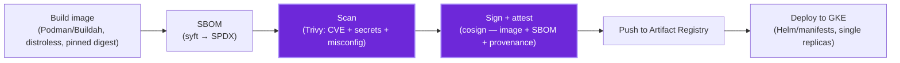

<!--
SPDX-License-Identifier: AGPL-3.0-only
Copyright (C) 2026 Danny Ota
-->

# Mise — CI/CD & Supply Chain

How mise **builds, gates, scans, and ships**. One CI pipeline per service (Go serving ·
Go worker · TS reasoning · Vue web), shared gates, bank-grade supply-chain controls.
This doc owns _pipeline + release + supply chain_; versions live in
[TOOLCHAIN.md](./TOOLCHAIN.md), tests in [TESTING.md](./TESTING.md).

See also:

- [TOOLCHAIN.md](./TOOLCHAIN.md)
- [TESTING.md](./TESTING.md)
- [FOLDER_STRUCTURE.md](./FOLDER_STRUCTURE.md) (deployables)
- [ARCHITECTURE.md](../design/ARCHITECTURE.md) §9 (deploy)
- [OBSERVABILITY.md](./OBSERVABILITY.md)

---

## 1. Principles

- **One deployable per service**, each its own container + CI job → independent build &
  scaling (FOLDER_STRUCTURE).
- **Reproducible:** pinned toolchains (TOOLCHAIN), pinned base images by digest, lockfiles
  committed (`go.sum`, `pnpm-lock.yaml`).
- **Fail closed:** every gate below blocks merge/release; nothing ships on a red gate.
- **Provenance:** every image is scanned, SBOM'd, and signed before deploy.

---

## 2. PR pipeline (every push / PR)

Runs per affected service (path-filtered); ordering is fail-fast.

| Stage         | Go (serving · worker)                       | TS (reasoning)                      | Vue (web)                           |
| ------------- | ------------------------------------------- | ----------------------------------- | ----------------------------------- |
| **Format**    | `golangci-lint fmt --diff` (no-write check) | `prettier --check`                  | `prettier --check`                  |
| **Lint**      | `golangci-lint run`                         | `eslint` + `knip`                   | `eslint` (+ vue) + `knip`           |
| **Types**     | `go vet ./...`                              | `tsc --noEmit`                      | `vue-tsc --noEmit`                  |
| **Modernize** | `go fix ./...` drift check (1.26)           | —                                   | —                                   |
| **Test**      | `go test -race -count=1 ./...`              | `vitest run`                        | `vitest run`                        |
| **SAST**      | `gosec` (via golangci) + `semgrep`          | `semgrep`                           | `semgrep` (+ eslint security rules) |
| **SCA**       | `govulncheck ./...` + `osv-scanner`         | `osv-scanner` + `pnpm audit --prod` | `osv-scanner` + `pnpm audit --prod` |
| **Build**     | `go build ./...`                            | `tsc -b`                            | `vite build`                        |

Plus repo-wide: **contract test** for the MCP/REST surface (TESTING §4) so `web` and
`reasoning` can't drift from `serving`; and **docs lint** — `markdownlint-cli2` +
`prettier --check` over `docs/**` and `*.md` (DOC_STYLE: mermaid-only, length budget).

**Integration (Go only, `master`-push, not every PR):** `go test -race -tags integration ./...`
against testcontainers `pgvector/pgvector:pg17` (TESTING §7), `timeout-minutes: 30`. Split out of
the PR-gate `go` job so the fast lint/unit/build loop never waits on a container pull + DB
migration; a PR that only touches Go still gets the fast job on every push, with the integration
job catching a regression once it lands on `master`.

---

## 3. Release pipeline (merge to master / tag)

> **Who runs this:** the **adopter** runs this pipeline in its **own** GCP project —
> building, scanning, and signing with **its own keys**, pushing to **its own** Artifact
> Registry (DELIVERY-MODEL §2/§3). Upstream ships **source + recipes only**; there is no
> upstream-built binary.

- **Build engine:** **Podman / Buildah** (rootless, daemonless) builds the `Containerfile`s —
  no Docker daemon in CI (CI-CD runs the same as a developer's laptop, LOCAL-DEV).
- **Images:** distroless/static base, non-root, read-only rootfs, pinned by **digest**.
- **SBOM:** generated per image (syft, SPDX) and stored as an attestation.
- **Scan:** Trivy (image CVEs + leaked secrets + IaC misconfig) — **fails on HIGH/CRITICAL**
  with no fix-pending waiver.
- **Sign + verify:** **cosign** signs image + SBOM + SLSA provenance; the GKE admission
  controller (Kyverno/Binary Authorization) **rejects unsigned images**.
- **Deploy:** Helm/manifests to the one GKE cluster (ARCHITECTURE §9); migrations run as a
  pre-deploy Job (`cmd/migrate`); KEDA scalers applied.

---

## 4. Security scanning & dependency hygiene

All scanners are **open-source, license-free, and CLI-first** — fast to set up, runnable
identically on a laptop and in CI (no SaaS account, no server):

| Layer           | Tool (OSS)                                                                                      | Catches                                                   | Where                                          |
| --------------- | ----------------------------------------------------------------------------------------------- | --------------------------------------------------------- | ---------------------------------------------- |
| **SAST** (code) | **gosec** (in golangci, Go) · **Semgrep** OSS (Go/TS/Vue, rule-based)                           | injection, unsafe crypto, secrets-in-code, taint patterns | PR (changed files) + nightly full              |
| **SCA** (deps)  | **govulncheck** (Go, call-graph-aware) · **osv-scanner** (Go + pnpm, Google OSV) · `pnpm audit` | known CVEs in dependencies                                | PR + nightly on `master`                       |
| **Licenses**    | **go-licenses** (Go) · `pnpm licenses` / `license-checker` (JS) · Trivy/syft (images)           | disallowed licenses in shipped deps                       | PR + release ([LICENSES.md](./LICENSES.md) §4) |
| **Secrets**     | **gitleaks**                                                                                    | committed creds/tokens                                    | pre-commit + PR                                |
| **Container**   | **Trivy**                                                                                       | image CVEs + IaC misconfig + secrets                      | release (§3)                                   |

- **`govulncheck` over generic SCA for Go:** it's call-graph-aware (flags only CVEs you
  actually reach) → far less noise, fast.
- **Semgrep OSS** (not the paid platform) runs from a pinned ruleset in-repo — no account.
- **License gate** enforces the allowlist (permissive only in shipped deps) — see
  [LICENSES.md](./LICENSES.md).
- **Nightly re-scan on `master`** catches CVEs disclosed _after_ merge.
- **Dependency bumps — default to Dependabot** (GitHub-native, free, **no AGPL**): grouped
  PRs, **digest-pinned base images**, security patches auto-merge on green, majors manual.
  \*Avoid self-hosted Renovate — its license rules it out ([LICENSES.md](./LICENSES.md) §2); use
  Mend's hosted app only if Dependabot is insufficient. Toolchain bumps (Go/Node/golangci-lint)
  are **reviewed changes** (TOOLCHAIN §1).

---

## 5. Secrets & access

- **No secrets in CI logs or env files.** CI authenticates to GCP via **Workload Identity
  Federation** (OIDC, keyless) — no long-lived service-account keys.
- Runtime secrets (the crawler's **AD service-account** / SMB creds — or an Azure AD app if
  Graph is used — plus DB creds) in **Secret Manager**, mounted at deploy
  (DATA-GOVERNANCE §7) — never baked into images.
- `.env*`, `*.key`, `*.pem` are git-ignored; a **gitleaks** pre-commit + CI scan backs it.

---

## 6. Upstream source releases (goreleaser)

> mise is AGPL source — the adopter builds and self-hosts (DELIVERY-MODEL). Upstream ships
> **source + CLI binaries** (no container images — those are adopter-built, §3).

**goreleaser** (v2, `.goreleaser.yaml`) cross-compiles the Go CLI binaries on `v*` tags:
`CGO_ENABLED=0`, `linux`/`darwin`/`windows` × `amd64`/`arm64`, version/commit/date injected
via ldflags. Archives: `tar.gz` (unix), `zip` (Windows). Signing with **cosign** (keyless,
OIDC). Changelog auto-generated from GitHub, excludes `docs`/`test`/`chore` commits. Proven
config from s1ctl.

---

## 7. CI/CD Defaults

- **CI host:** GitHub Actions, matching the repo's `.github/workflows/` layout.
- **Admission control:** GCP Binary Authorization for the reference GKE deployment; Kyverno is an
  adopter-owned portability variant.
- **Monorepo build cache:** plain path-filtered jobs first. Add Nx/Turborepo only if CI runtime
  proves it is worth the extra moving parts.
- **Dependabot security patches:** reviewed PRs; no automatic merge without green gates and human
  review.
