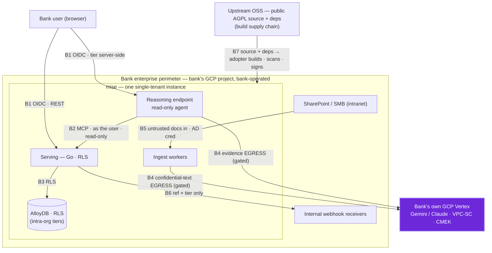

<!--
SPDX-License-Identifier: AGPL-3.0-only
Copyright (C) 2026 Danny Ota
-->

# Mise — Threat Model

A **design-level** threat model: the assets mise protects, its **trust boundaries**, and a
**STRIDE** pass mapped to the controls the design already commits to — plus the **residual
risks** to watch. This doc owns the _adversary view_; the controls themselves live in their
governance/engineering docs (it points, never restates), and the posture summary +
vulnerability-disclosure process is [SECURITY.md](../../SECURITY.md).

See also:

- [SECURITY.md](../../SECURITY.md)
- [AI-GOVERNANCE.md](../design/AI-GOVERNANCE.md) §5/§8
- [DATA-GOVERNANCE.md](../design/DATA-GOVERNANCE.md) §2/§7/§9
- [CI-CD.md](./CI-CD.md) §3-5
- [DELIVERY-MODEL.md](./DELIVERY-MODEL.md) (tenancy)
- [ARCHITECTURE.md](../design/ARCHITECTURE.md) §2
- [DECISIONS.md](../project/DECISIONS.md) 9/10/13/17/19

---

## 1. Scope & method

- **Deployment model (frames everything).** mise is **single-tenant: one instance deployed
  per enterprise, in the bank's own GCP project, operated by the bank's own ops team**
  (DELIVERY-MODEL, DECISIONS 9). mise is **open source (AGPL); the adopter builds from public
  source and self-hosts** — there is **no proprietary vendor binary** and **no upstream runtime
  access or upstream-held data**. So nearly the whole stack sits **inside one bank's security
  perimeter**; the only flows that **cross** it are the **Vertex egress (B4)** and the
  **build/dependency supply chain (B7)**. There is **no multi-tenant isolation concern** —
  access tiers (group vs local) are **intra-org** (DATA-GOV §2).
- **Method:** design-level STRIDE + trust-boundary analysis over the architecture
  (ARCHITECTURE §2) — not a code audit. The point is to catch architectural gaps while cheap.
- **In scope:** the four services (web · reasoning · serving · worker), the database, the AI
  egress, the ingest connectors, external egress (webhooks), and the supply chain.
- **Deferred to build (§6):** concrete dependency CVEs (continuous via CI scanners, CI-CD §4),
  cluster/runtime hardening specifics (DEPLOYMENT), and penetration / red-team testing.

---

## 2. Assets (what we protect)

| Asset                                                                                            | Why it matters                                            | Primary control                                                   |
| ------------------------------------------------------------------------------------------------ | --------------------------------------------------------- | ----------------------------------------------------------------- |
| **Confidential corpora** (`group-std`, `local-policy`, `local-sop`) — verbatim text + embeddings | leak = a data breach of bank-internal controls            | tier + **RLS** (DATA-GOV §2); model-egress gate (AI-GOV §7)       |
| **Graph attestations + golden set**                                                              | irreplaceable; not regenerable by re-ingest               | promote gate + audit (AI-GOV §4); backed up first (DEPLOYMENT §3) |
| **The evidence-only invariant**                                                                  | the product's trust property — "never asserts compliance" | grounding gates + read-only agent (AI-GOV §1/§5)                  |
| **Audit trail**                                                                                  | non-repudiation of every read, attestation, model turn    | append-only, immutable (DATA-GOV §6/§9)                           |
| **Credentials** (AD service account, DB, Vertex ADC)                                             | a pivot to everything above                               | Secret Manager; keyless WIF in CI (CI-CD §5)                      |
| **Access-tier metadata**                                                                         | mis-set tier = wrong disclosure                           | assigned at ingest, DB-enforced (DATA-GOV §2)                     |

---

## 3. Trust boundaries

Almost everything runs **inside the bank's perimeter** (its own GCP project, bank-operated).
Only **B4** (Vertex egress) and **B7** (the build/dependency supply chain) cross that perimeter.

| #      | Boundary                     | Crosses perimeter? | Rule                                                                                                                                               |
| ------ | ---------------------------- | ------------------ | -------------------------------------------------------------------------------------------------------------------------------------------------- |
| **B1** | browser ↔ backend            | no (intranet)      | client is **fully untrusted**; OIDC every call; tier **resolved server-side**, never client-asserted (API-CONTRACT §1)                             |
| **B2** | reasoning ↔ serving (MCP)    | no                 | agent calls **as the user** (tier propagated); **read-only**, allow-listed tools only                                                              |
| **B3** | serving ↔ AlloyDB            | no                 | caller tier bound to the **DB session role** → RLS (intra-org tiers)                                                                               |
| **B4** | backend ↔ Vertex             | **yes**            | **confidential-text egress** to the bank's own GCP Vertex — allowed by DECISIONS 10/17; region is deploy config                                    |
| **B5** | connectors ↔ SharePoint/SMB  | no                 | **inbound documents are untrusted input**; outbound is a scoped AD credential                                                                      |
| **B6** | notifications ↔ webhooks     | no (internal)      | egress carries a **reference + tier badge only**, never confidential content                                                                       |
| **B7** | upstream OSS → adopter build | **yes**            | adopter builds from **auditable AGPL source**, scans, and **signs with its own keys** before admission (CI-CD §3/§4); no proprietary vendor binary |

---

## 4. STRIDE — threats → controls → residual

| Category            | Threat                                                              | Control (owning doc)                                                                                                                         | Residual                                                                  |
| ------------------- | ------------------------------------------------------------------- | -------------------------------------------------------------------------------------------------------------------------------------------- | ------------------------------------------------------------------------- |
| **Spoofing**        | forged identity / self-asserted tier                                | OIDC; tier resolved server-side, never trusted from the client (API-CONTRACT §1, DATA-GOV §7)                                                | IdP compromise (bank's own IdP)                                           |
| **Tampering**       | alter edges / attestations / audit rows                             | promote gate; append-only audit; idempotent, content-hashed ingest (AI-GOV §4, DATA-GOV §6)                                                  | privileged DB insider (see §5)                                            |
| **Repudiation**     | deny making an attestation / decision                               | every promote/reject/relink logs actor `(role+dept)` + ts (DATA-GOV §6)                                                                      | shared service accounts dilute attribution (DECISIONS 13)                 |
| **Info disclosure** | cross-tier read via a graph join                                    | **RLS at the DB**; an edge inherits the **stricter** tier (DATA-GOV §2)                                                                      | an RLS-policy bug → **mandatory RLS tests** (TESTING §2)                  |
|                     | reasoning endpoint reads under the **wrong tier** (confused deputy) | MCP called **as the user** — identity forwarded, tier is never the service's (API-CONTRACT §1/§2)                                            | a propagation bug → caught by RLS + contract tests (TESTING §2/§4)        |
|                     | confidential text reaching Vertex models                            | model-egress **gate** (AI-GOV §7); the bank's own Vertex + VPC-SC/CMEK                                                                       | accepted reference egress; adopter may self-host by stricter policy       |
|                     | query logs / translation cache leak                                 | hash queries, no raw text logged; cache by source-hash, tier-gated (DATA-GOV §6, OBS §5, AI-GOV §7)                                          | cache eviction/retention discipline (DATA-GOV §9)                         |
|                     | webhook leaks confidential payload                                  | reference + tier only; receiver re-auths under its own RLS (DATA-GOV §8)                                                                     | mis-set subscription tier cap                                             |
|                     | webhook `endpoint_url` aimed at an **internal** address (SSRF)      | HMAC-signed delivery; admin-only subscription; egress policy to lock in DECISIONS 19 (DATA-MODEL §10)                                        | until DEC 19 closes, webhook delivery stays disabled or internal-only     |
| **DoS**             | exhaust the no-HA, scale-to-zero stack                              | cold-start SLO budget (OBS §4); crawler throttle; **bounded agent loops + max_tokens** (AI-GOV §5)                                           | availability is **best-effort by design** (DECISIONS 9)                   |
| **Elevation**       | prompt injection via an ingested document                           | evidence is **data, not instructions**; agent is **read-only**, no fs/bash, deny-by-default (AI-GOV §5/§8)                                   | bounded — injection can't exceed the **caller's** tier                    |
|                     | MCP tool abuse                                                      | allow-list `mcp__mise__*`, all read-only (API-CONTRACT §2)                                                                                   | new tools must re-clear the gate                                          |
|                     | over-scoped crawler credential / MFA exception                      | scoped read-only service account, IP-allowlisted, **security sign-off** (DECISIONS 13, DEPLOYMENT §4)                                        | a standing intranet-read credential (see §5)                              |
|                     | compromised **upstream source** or OSS dependency (B7)              | **auditable public source** (sole author, no external PRs merged — CONTRIBUTING); adopter's own build + scan + **sign** + SBOM (CI-CD §3/§4) | a malicious dependency / upstream compromise → nightly re-scan (CI-CD §4) |

---

## 5. Top residual risks (watchlist)

1. **Confidential text → Vertex egress.** DECISIONS 10/17 lock the reference design:
   confidential internal control text may use the **bank's own** GCP Vertex (its terms, region,
   VPC-SC/CMEK). The residual is policy drift: if an adopter later bars managed AI for this data
   class, the confidential path uses the self-hosted AI stack.
2. **RLS correctness.** One policy bug collapses tier isolation across the whole join surface.
   The only thing standing between design and breach is the **mandatory RLS test suite**
   (TESTING §2) — keep it exhaustive, including cross-corpus graph joins.
3. **Build / dependency supply chain (B7).** The adopter builds from **public AGPL source** —
   auditable, no proprietary binary, and no external PRs merged (CONTRIBUTING), which shrinks
   the tampering surface. **OSS dependencies** remain the vector; mitigate with the adopter's
   own scan + sign + SBOM and nightly re-scan (CI-CD §3/§4).
4. **Crawler service account + MFA exception (DECISIONS 13).** A standing, broadly-read credential
   into the bank intranet. Keep it scoped read-only, IP-allowlisted, and re-reviewed.
5. **Prompt injection.** Bounded today by the read-only, tier-scoped agent — but revisit the
   instant the agent gains any write or wider tool scope.
6. **Attestation / graph integrity.** Irreplaceable data; a DB-write insider is the residual.
   Back it up first (DEPLOYMENT §3) and watch the audit trail for anomalous promotes.

---

## 6. Deferred to the build phase

- **Dependency CVE posture** — continuous, via the CI scanners (CI-CD §4); not enumerated here.
- **Cluster / runtime hardening** — network policy, admission rules, pod security (DEPLOYMENT).
- **Webhook egress allowlist / `endpoint_url` validation** to prevent SSRF (DECISIONS 19; the
  subscription schema is DATA-MODEL §10).
- **Penetration test + red-team** of the deployed system, including an LLM-injection red-team.
- **Per-service STRIDE refinement** once code and concrete data flows exist.
