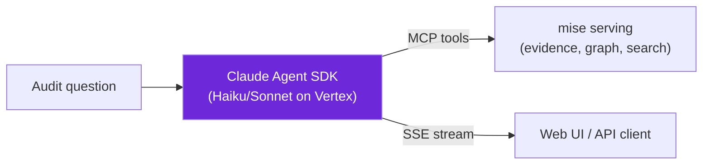

<!--
SPDX-License-Identifier: AGPL-3.0-only
Copyright (C) 2026 Danny Ota
-->

# Audit Q&A

The reasoning endpoint answers audit questions with **cited, grounded** evidence. It runs
server-side (never in the browser) and streams answers via SSE.

## How it works



The Claude agent has access to mise's MCP tools (read-only, tier-filtered):

- `search` — hybrid retrieval (ScaNN + FTS, RRF) over any corpus the caller can see
- `document` — fetch a full provision with metadata and citations
- `graph` — walk the compliance chain (edges, evidence, findings)

The agent decides what to do: search, walk the graph, compose a cited answer, or **abstain**
if the evidence doesn't support an answer.

## REST API

```bash
# Ask a question (SSE stream)
curl -N http://localhost:3000/api/v1/qa \
  -H 'Content-Type: application/json' \
  -d '{"question": "What are the IT system safety requirements for banks in Vietnam?"}'
```

SSE events:

- `token` — answer text (streaming)
- `citation` — a cited source span
- `chain` — the compliance chain the agent traversed
- `evidence_checked` — evidence verified via grounding
- `abstain` — the agent could not ground an answer
- `done` — stream complete
- `error` — something went wrong

## Grounding & abstain

The agent **never asserts** what it can't ground:

- Every claim in the answer must have a `citation` event linking to a verbatim source span.
- If the evidence is insufficient, the agent emits `abstain` with a reason — it does not
  hallucinate an answer.
- The grounding guarantee is enforced by the Agent SDK's PostToolUse hook: the agent's output
  is checked against the cited evidence before delivery.

## Access tiers

The agent sees only what the caller's tier allows:

- A `public`-tier caller gets answers from public law only.
- A `group-confidential` caller sees law + Group standards.
- A `local-confidential` caller sees everything.

RLS filtering happens at the database — the agent cannot bypass it even if prompted to.

## What's next

- [Web UI](web-ui.md) — the full product in a browser.
- [API-CONTRACT §4](/design/API-CONTRACT.md) — SSE event specification.
- [AI-GOVERNANCE §5](/design/AI-GOVERNANCE.md) — agent guardrails and audit.
