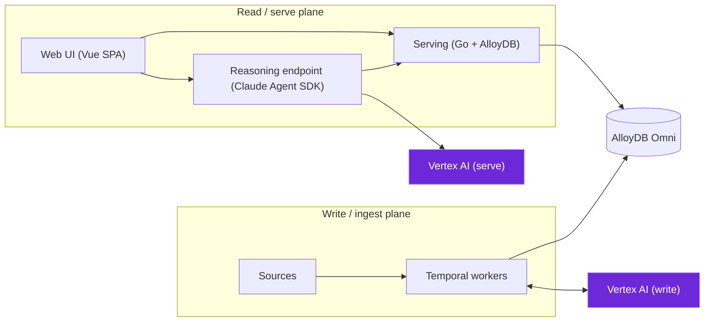

<!--
SPDX-License-Identifier: AGPL-3.0-only
Copyright (C) 2026 Danny Ota
-->

# Overview

mise is **evidence-only regulatory & policy intelligence** for banks. It ingests regulatory
law (Vietnam, Malaysia) and an institution's internal control documents, embeds them into one
shared vector space, builds a cross-corpus compliance graph, detects gaps/conflicts/staleness,
and answers audit questions with cited, grounded evidence.

## What it does

1. **Ingests 5 corpora** — VN & MY regulation (public) + Group standards / Local policies / SOPs
   (internal, tiered) — into one AlloyDB instance with per-corpus schemas and RLS.
2. **Builds a compliance graph** — which control _satisfies_ which law, which policy _implements_
   which standard — with every AI-proposed edge gated by a grounding check and human attestation.
3. **Detects issues** — gaps (unmapped obligations), conflicts (standard vs law contradiction),
   staleness (law amendments that outdate downstream controls).
4. **Answers audit questions** — a backend Claude agent composes cited answers over the evidence;
   the read path is fast (Go + AlloyDB); reasoning runs server-side via the Claude Agent SDK.
5. **Never asserts compliance** — mise serves verbatim evidence and human-attested mappings only.

## Architecture at a glance

## Key design choices

- **Single-tenant, bank-operated** — one instance per enterprise, in the bank's own GCP project.
- **AGPL-3.0 open source** — build from source, self-host; dual-license option for the author.
- **Evidence-only** — no AI-generated assertions; every answer traces to a verbatim source span.
- **Human-in-the-loop** — AI proposes, grounding gates, humans attest. Nothing auto-promotes.
- **One embedding space** — `gemini-embedding-001` @ 1536-d across all corpora.

## Next steps

- [Deploy mise](deploy.md) — set up the GKE cluster and local dev stack.
- [Ingest your first corpus](first-corpus.md) — public law (no internal docs needed).
