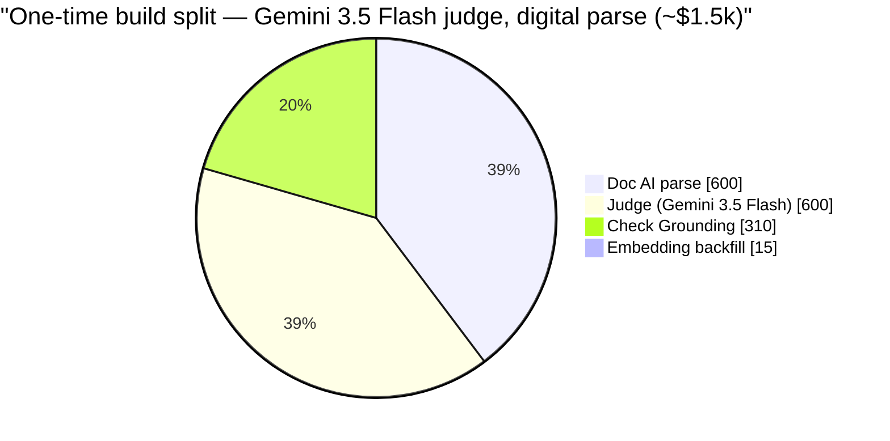
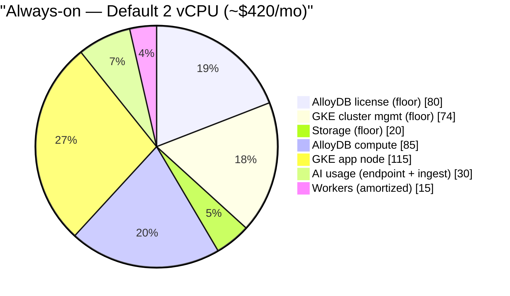
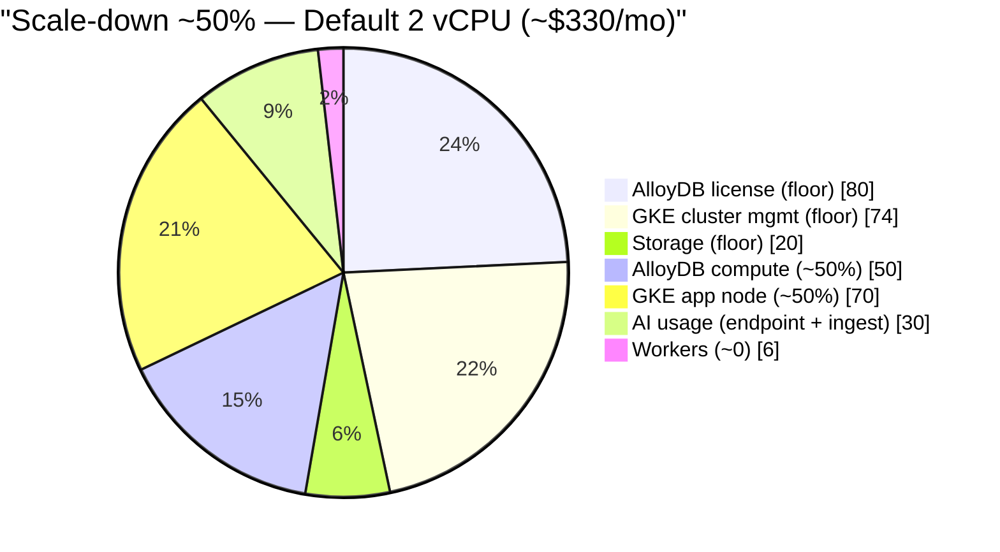

# Mise — Cost Model

Cost estimate driven by **data volume**, scoped to **all banking regulation** (not
just the digital/technology subset that today's digital/technology indexes carry).

See also:

- [ARCHITECTURE.md](../design/ARCHITECTURE.md)
- [DATA-GOVERNANCE.md](../design/DATA-GOVERNANCE.md)
- [AI-GOVERNANCE.md](../design/AI-GOVERNANCE.md)
- [DATA-MODEL.md](../design/DATA-MODEL.md)
- [PLAN.md](./PLAN.md)
- [DECISIONS.md](./DECISIONS.md)

> Unit rates captured ~June 2026 from public Google Cloud pricing — **verify
> against the official pricing pages before budgeting.** Figures are planning
> estimates, USD, on-demand (no committed-use discounts, which cut compute 20–55%).
> Excludes: engineering labour, Microsoft 365 / SharePoint licensing, GCP support
> plan, network egress, and any duplicated dev/staging environment.
>
> **Deployment profile for this estimate:** a **single-tenant instance per enterprise** (in
> the bank's own GCP project) — so these are **per-deployment** costs. Everything on **one
> GKE cluster** (no
> Cloud Run), **no HA** (single replicas), **low query volume**, and **infrequent
> indexing** — a read/query-focused workload. The ingestion worker pool scales to
> zero between runs; Temporal persistence reuses the shared DB instance.

---

## 1. Data assumptions (full banking scope)

| Corpus                                     |       Docs | Avg pages/doc |        Pages | Chunks/doc |       Chunks |
| ------------------------------------------ | ---------: | ------------: | -----------: | ---------: | -----------: |
| `vn-reg` Vietnam regulatory (all banking)  |      4,000 |            25 |      100,000 |         65 |      260,000 |
| `my-reg` Malaysia regulatory (all banking) |        500 |            60 |       30,000 |        130 |       65,000 |
| `group-std`                                |        250 |            30 |        7,500 |         40 |       10,000 |
| `local-policy`                             |        300 |            25 |        7,500 |         35 |       10,500 |
| `local-sop`                                |      1,200 |            12 |       14,400 |         20 |       24,000 |
| **Total**                                  | **~6,250** |               | **~160,000** |            | **~370,000** |

Scale reference: the current digital/technology index is ~712 docs / 47k chunks — full
banking is roughly **5–6× larger**. Embedding workload ≈ 370k chunks × ~350 tokens
≈ **~130M tokens**. At 1536-d float32, raw vectors ≈ **~2.3 GB** (≈6 GB even at 1M
chunks) — comfortably one DB node.

---

## 2. Unit rates (≈ June 2026)

| Service                                                            | Rate                                                               |
| ------------------------------------------------------------------ | ------------------------------------------------------------------ |
| Document AI **Layout Parser**                                      | $10 / 1,000 pages (incl. initial chunking)                         |
| `gemini-embedding-001`                                             | $0.15 / 1M tokens ($0.075 batch)                                   |
| **Gemini 3.5 Flash** (Vertex) — default                            | $1.50 in / $9 out per 1M (global; $0.15 cached-in; batch −50%)     |
| **Claude Haiku 4.5** (Vertex)                                      | $1 in / $5 out per 1M (batch −50%; cache −90%)                     |
| **Claude Sonnet 4.6** (Vertex)                                     | $3 in / $15 out per 1M (batch −50%; cache −90%)                    |
| Grounding on your own data (Grounded Generation / Check Grounding) | ~$2.50 / 1,000 requests                                            |
| Ranking API                                                        | ~$1 / 1,000 requests _(approx — verify)_                           |
| **AlloyDB Omni** production license                                | ~$40 / vCPU-month, month-to-month (free for dev/non-prod) — verify |
| GKE node e2-standard-8 (8 vCPU/32 GB)                              | ~$200 / mo                                                         |
| GKE node e2-standard-4 (4 vCPU/16 GB)                              | ~$100 / mo                                                         |

---

## 3. AI models — where they run & the one-time build

AI is **front-loaded into ingest**, not the live serving path. Each model mapped to
its cost line:

| AI component                                                 | Path                                     | When                   | Cost line                        |
| ------------------------------------------------------------ | ---------------------------------------- | ---------------------- | -------------------------------- |
| **Doc AI Layout Parser**                                     | write (parse/chunk)                      | one-time + rare ingest | one-time below · §4 Vertex-write |
| **gemini-embedding-001** (doc chunks)                        | write (embed corpus)                     | one-time + rare ingest | one-time below · §4 Vertex-write |
| **gemini-embedding-001** (user query)                        | **read** (cached)                        | per query              | §4 Vertex-read (~$0–2)           |
| **Judge LLM** (Gemini 3.5 Flash / Haiku 4.5 / Sonnet 4.6)    | write (RelationDetect)                   | one-time + rare ingest | one-time below · §4 Vertex-write |
| **Ranking API + Check Grounding**                            | write (verify edges)                     | one-time + rare ingest | one-time below · §4 Vertex-write |
| **Answer agent** — Claude Haiku 4.5 / Sonnet 4.6 (Agent SDK) | **serve** (reasoning endpoint, not mise) | per answer             | §4 Reasoning endpoint (~$20–40)  |

**Takeaway:** the read/serving path is **deliberately AI-free** — mise returns
pre-computed evidence with one cached query-embed (≈$0). All heavy AI (parse · embed ·
judge · ground) runs **once at ingest** (the table below), and live answer reasoning is
the **endpoint's** spend. On the recurring bill AI is only **~10–15%** (~$20–70/mo);
the rest is fixed compute (§4). That's by design (evidence-only, read-fast).

### One-time build (ingest + initial relation pass)

| Item                                                                                       | Volume               |                                                              Cost |
| ------------------------------------------------------------------------------------------ | -------------------- | ----------------------------------------------------------------: |
| Parsing — born-digital VN via cheap digital parse; Doc AI Layout for the rest (~60k pages) | 60k pages            |                                                             ~$600 |
| &nbsp;&nbsp;_(worst case: all 160k pages via Doc AI Layout)_                               | 160k pages           |                                                         _~$1,600_ |
| Embedding backfill                                                                         | ~130M tokens (batch) |                                                           ~$10–20 |
| Relation judge — law-facing only (~123k calls)                                             | Gemini 3.5 Flash     |                                                             ~$600 |
| &nbsp;&nbsp;_(Haiku 4.5 — cheapest for bulk judging)_                                      | Haiku 4.5            |                                                           _~$370_ |
| &nbsp;&nbsp;_(Sonnet 4.6 — hardest cross-lingual)_                                         | Sonnet 4.6           |                                                         _~$1,100_ |
| Grounding verify (~123k requests)                                                          | $2.50/1k             |                                                             ~$310 |
| **One-time total**                                                                         |                      | **~$1.3k (Haiku + digital parse) → ~$3.0k (Sonnet + all Doc AI)** |

Only `local-policy` + `group-std` clauses (~20k) need law-facing `satisfies`
judging; `implements`/`derives` are extracted (free). ~6 candidates/clause ⇒
~123k judge+grounding calls.

The one-time build **is** the AI spend (~~$1.3–3k of essentially pure AI). Parse and
judge dominate; grounding is meaningful; embedding is negligible. Swapping the judge to
Haiku 4.5 (~$370) or Sonnet 4.6 (~~$1.1k) moves the second slice.

---

## 4. Recurring (monthly)

**Bottom line (Default = AlloyDB Omni 2 vCPU):** **~$300–360/mo** with auto scale-down
(~50% real utilization; ≈$330 typical), or **~$390–490/mo** always-on. Plus the **~$1–3k one-time**
build (§3).

Profile: query path auto-scales on usage; ingestion workers scale to zero between
(rare) indexing runs; single replicas; Temporal reuses the shared DB. The sizing
rationale ("why the license is worth it") is at the end of this section.

### Monthly line items — Default 2 vCPU: always-on vs scale-down

**Scale-down** = KEDA + cluster autoscaler shrink compute to real usage (~50%). The
license + cluster-mgmt + storage **floor (~$174)** can't scale; the usage-metered
Vertex / endpoint lines are already proportional to traffic.

| Item                                                                    | Assumption                           | Always-on /mo | Scale-down ~50% /mo |
| ----------------------------------------------------------------------- | ------------------------------------ | ------------: | ------------------: |
| AlloyDB Omni **license**                                                | 2 vCPU × ~$40 — **fixed floor**      |          ~$80 |                ~$80 |
| AlloyDB Omni compute (node)                                             | 2 vCPU / 16 GB, scales w/ load       |      ~$70–100 |             ~$40–50 |
| GKE app node (serving/API/UI/MCP + Temporal)                            | e2-standard-4, KEDA + autoscaler     |     ~$100–130 |             ~$50–65 |
| GKE ingestion workers                                                   | scale-to-zero                        |        ~$0–20 |              ~$0–10 |
| GKE cluster mgmt                                                        | $0.10/hr (**$0** free zonal) — fixed |        ~$0–74 |              ~$0–74 |
| Storage (DB disk + GCS)                                                 | ~150–250 GB — fixed                  |          ~$20 |                ~$20 |
| Vertex — write path (parse·embed·judge·ground)                          | rare ingest, usage-metered           |        ~$0–35 |              ~$0–35 |
| Vertex — read path (cached query-embed)                                 | usage-metered                        |         ~$0–2 |               ~$0–2 |
| Reasoning endpoint — Claude Haiku/Sonnet via Agent SDK (compose + cite) | usage-metered                        |       ~$20–40 |             ~$20–40 |
| **Total (Default 2 vCPU)**                                              |                                      | **~$390–490** |       **~$300–360** |

> **Evidence-only note:** on read mise only embeds the (cached) query; the endpoint's
> optional rerank/compose/ground is included above for whole-system budgeting, not
> billed to mise serving. Other vCPU sizes and the pgvector fallback are in §6.

**Always-on vs scale-down (~50%).** Same slice order in both; the floor (first three
slices) is identical — only compute / app-node / workers shrink.

> GitHub stacks these (it can't place two mermaid diagrams in one row); an HTML-capable
> mermaid viewer shows them side-by-side.

### Auto scale-down — mechanism

Compute auto-scales to real usage (~50%); usage-metered lines are already proportional:

- **Stateless services** (serving/API/UI/MCP, Temporal) → **KEDA** + **cluster
  autoscaler** scale replicas/nodes to load (to `minReplicas=0` when idle); pre-warm
  before known busy windows to hide cold starts.
- **Ingestion workers** → already scale to zero.
- **Database** → when idle the AlloyDB Omni pod can shrink/stop, saving its **compute**
  (PVC persists; ~1–2 min cold start). The reference model treats the license as a fixed floor
  (DECISIONS 16): license + cluster management + storage are the costs scaling cannot remove.
  Verify current vendor metering before budgeting, but the upstream store strategy is locked.

### Why the license is worth it (sizing)

AlloyDB Omni adds a **per-vCPU license (~$40/vCPU-mo)** paid regardless of query
volume — so the lever is **vCPU count, not usage**. Vector search is memory-bound and
the heavy AI runs off-box (Vertex on write, endpoint on read), so the DB only does
retrieval + joins: **2 vCPU fits** this ~2.3 GB / low-QPS data (1 vCPU viable at low
concurrency — **verify the licensed minimum**; 8 vCPU would be 4× the license for no
gain). The license buys **ScaNN + adaptive filtering + columnar**, and since every
read is access-tier/RLS **filtered**, ScaNN's filtered-search edge is user-facing — so
it earns out. **Dev/non-prod is free.**

---

## 5. Key insights & cost levers

1. **Fixed-compute dominated (~85%), not AI usage (~15%).** The Vertex AI bill is
   small (~$150–500/mo); always-on DB + GKE compute is the driver. Scale the
   _infrastructure_, not the API calls, to control cost.
2. **The architecture already banked the biggest saving.** Choosing
   pgvector/AlloyDB over **Vertex AI Vector Search** avoided per-index always-on
   serving nodes — at 5 corpora that would have been roughly **$2,500–10,000/mo**
   for vectors alone.
3. **AlloyDB Omni cost = vCPU count, not usage.** The ~~$40/vCPU-mo license is fixed
   regardless of query volume, so **right-sizing the vCPUs is the only lever** —
   2 vCPU (~$80/mo) fits this data/QPS; 8 vCPU would be 4× that for no benefit.
   Dropping to pgvector removes the license entirely (~~−$80/mo at 2 vCPU) if cost
   ever outweighs ScaNN's filtered-search gain. Here the read path is **always
   filtered** (access-tier/RLS), so that gain is user-facing — the license earns out.
4. **Full-bank vs tech-only is cheap to add:** ~$1–2k extra one-time
   (parse+embed+judge); **~$0 extra recurring** until the corpus outgrows a node
   (1M vectors still ≈ 6 GB).
5. **Doc AI parsing is the largest one-time line** — halve it by digital-parsing
   born-digital VN/HTML and reserving Doc AI Layout for PDFs/scanned/internal.
6. **Model routing matters on the judge — all on Vertex** (one auth / governance
   boundary). **Haiku 4.5** is cheapest for the ~~123k-call judge (~~$370),
   **Gemini 3.5 Flash** is the default (~$600; native Grounding/Ranking ecosystem),
   **Sonnet 4.6** for the hardest cross-lingual judging (~$1.1k). Batch halves each.
   Answer composition is the **serve endpoint's** call — Claude Haiku 4.5 / Sonnet 4.6
   via the Agent SDK — outside mise's serving cost.
7. **This profile is compute-floored — so scale-down is the biggest lever.** With no
   HA, low query volume, and rare indexing, recurring cost is essentially **two small
   GKE nodes**. The largest recurring saving is **auto scale-down** (~50% utilization
   → Default ~$420 → **~$330/mo**); then the free zonal GKE tier (−$74) or
   consolidating to one node. Vertex/endpoint AI is ~10–15% and the worker pool is
   ~$0 at rest. The one-time build dominates the first year.

---

## 6. Sensitivity

| Change                                         |                     Δ cost |
| ---------------------------------------------- | -------------------------: |
| AlloyDB Omni 2 → 4 vCPU                        | +~$150/mo (license + node) |
| AlloyDB Omni 2 → 8 vCPU                        |                  +~$460/mo |
| Drop AlloyDB → pgvector                        | −~$80/mo (removes license) |
| Free zonal GKE cluster tier                    |                   −~$74/mo |
| Audit Q&A 1k → 5k /mo                          |                  +~$100/mo |
| Judge Flash → Pro                              |             +$600 one-time |
| Add HA later (DB replica + extra node)         |              +~$250–300/mo |
| Committed-use discount (1–3 yr) on GKE compute | −20% to −55% on node lines |
| Duplicate dev/staging env                      |              +~$200–300/mo |
