<!--
SPDX-License-Identifier: AGPL-3.0-only
Copyright (C) 2026 Danny Ota
-->

# Mise — Roadmap

The milestone view of the build: the phases as **milestones M0–M10**, the **critical path**
that links them, the **exit gates** each milestone must satisfy, and the **review-load** shape
that paces a solo part-time build. It owns _sequence + gating_; the per-milestone task detail is
[plan/](./plan/README.md), the goals + delta are under [plan/](./plan/README.md), execution risk
is [RISKS](./RISKS.md).

See also:

- [PLAN](./PLAN.md) (build-plan index)
- [GOALS](./plan/GOALS.md)
- [DELTA](./plan/DELTA.md)
- [RISKS](./RISKS.md)
- [DECISIONS](./DECISIONS.md)
- [COST](./COST.md)
- [M0](./plan/M0-skeleton/README.md)
- [M1](./plan/M1-ingest/README.md)
- [M2](./plan/M2-graph/README.md)
- [M3](./plan/M3-detectors/README.md)
- [M4](./plan/M4-audit-qa/README.md)
- [M5](./plan/M5-web-ui/README.md)
- [M6](./plan/M6-scale/README.md)
- [M7](./plan/M7-review/README.md)
- [M8](./plan/M8-release/README.md)
- [M9](./plan/M9-internal-sources/README.md)
- [M10](./plan/M10-rest-completion/README.md)

---

## 1. Milestones

Each phase reaches one milestone; the milestone _is_ the phase's demonstrable outcome.

| Milestone  | Plan                                                        | Delivers                                                                                                                              | First demoable value                                  |
| ---------- | ----------------------------------------------------------- | ------------------------------------------------------------------------------------------------------------------------------------- | ----------------------------------------------------- |
| **M0**     | [M0-skeleton](./plan/M0-skeleton/README.md)                 | the stack stands up locally — module, corpus registry, AlloyDB + Temporal, Vertex fake seam                                           | `podman compose up` is green                          |
| **M1a**    | [M1-ingest](./plan/M1-ingest/README.md) WS1+4               | law corpora ingested, embedded @1536-d, searchable per-corpus (public, ungated)                                                       | per-corpus evidence search (MCP) on VN+MY law         |
| **M1b**    | [M1-ingest](./plan/M1-ingest/README.md) WS2+3               | internal corpora ingested via SharePoint, metadata envelope + tier tagging complete                                                   | all 5 corpora tier-isolated and retrievable           |
| **M2**     | [M2-graph](./plan/M2-graph/README.md)                       | the `graph` schema + explicit internal edges + graph API (done)                                                                       | the SOP→Policy→Group chain query                      |
| **M3** ✅  | [M3-detectors](./plan/M3-detectors/README.md)               | the 4 detectors + findings + the review queue                                                                                         | a grounded `satisfies` candidate + a conflict finding |
| **M4** ✅  | [M4-audit-qa](./plan/M4-audit-qa/README.md)                 | cited, grounded answers over REST + MCP + SSE                                                                                         | ask a question → cited answer / abstain               |
| **M5** ✅  | [M5-web-ui](./plan/M5-web-ui/README.md)                     | all screens live in the Vue SPA                                                                                                       | the full product in a browser                         |
| **M6** ✅  | [M6-scale](./plan/M6-scale/README.md)                       | corpus registry GA + multimodal + new scope by descriptor only                                                                        | add a corpus with zero core edits                     |
| **M7** ✅  | [M7-review](./plan/M7-review/README.md)                     | design-doc set audited for consistency, completeness, and correctness                                                                 | a clean, trustworthy spec                             |
| **M8** ✅  | [M8-release](./plan/M8-release/README.md)                   | v0.1.0 open-source release under AGPL-3.0                                                                                             | tagged release on GitHub                              |
| **M9** ✅  | [M9-internal-sources](./plan/M9-internal-sources/README.md) | the document-library connector — internal corpora ingestable from a drop folder (SharePoint crawl stays deferred)                     | drop a Group standard → tier-gated search hit         |
| **M10** ✅ | [M10-rest-completion](./plan/M10-rest-completion/README.md) | the REST surface the Web UI needs — dashboard, graph canvas, timeline, notifications, webhooks; one RegisterAll for router + contract | every Web UI screen loads against the live stack      |

---

## 2. Critical path

**Solo + part-time ⇒ strictly sequential** (PLAN): one phase at a time, each gating the next.
There is no parallel track to exploit; the lever is keeping each phase's scope tight.

```mermaid
flowchart LR
    M0["M0 — stack up"] --> M1a["M1a — law ingest (public)"]
    M1a --> M1b["M1b — internal connectors"]
    M1a --> M2["M2 — graph spine"]
    M1b --> M2
    M2 --> M3["M3 — detectors"]
    M3 --> M4["M4 — Audit Q&A"]
    M4 --> M5["M5 — Web UI"]
    M5 --> M6["M6 — scale"]
    M6 --> M7["M7 — review"]
    M7 --> M8["M8 — v0.1.0"]
    M8 --> M9["M9 — library connector"]
    M9 -.-> M1b
    M9 --> M10["M10 — REST completion"]
    classDef gated fill:#6d28d9,stroke:#a78bfa,color:#fff,stroke-width:2px
    classDef public fill:#059669,stroke:#34d399,color:#fff,stroke-width:2px
    classDef release fill:#b45309,stroke:#fbbf24,color:#fff,stroke-width:2px
    class M1b,M3,M4 gated
    class M1a public
    class M8 release
```

- **Green = runs entirely on public data** — M1a (law ingest: WS1 + WS4) delivers per-corpus
  evidence search over `vn-reg` + `my-reg` without any internal doc access.
- **Violet = has non-code exit gates** (§3) — M3/M4 have open implementation-review
  decisions; M1b has real-adopter connector integration input. M0's own gate (DEC 14, embedding
  call site) is locked.
- **Amber = release milestone** — M8 publishes v0.1.0 on GitHub under AGPL-3.0.
- **M1a/M1b split:** M1a (public law corpora) is ungated and exits independently; M1b (internal
  connectors: WS2 + WS3) runs when SharePoint access materializes. M2's graph schema,
  extraction, and API are complete; live Method-A wiring into an internal-corpus ingest run
  is deferred to M1b (the connectors that produce the doc-control headers). See
  [M1 plan](./plan/M1-ingest/README.md) §1.
- **Fan-in, not a parallel path:** M4 reads M1+M2+M3 artifacts and M5 reads M2+M3+M4 — drawn
  linearly because one builder runs them in order, but each later phase depends on _all_ prior.
- **Earliest value lands at M1a** (evidence search) and again at **M4** (Q&A); M5 makes it a
  product. If priorities force a cut, M1a→M4 is the spine; M5/M6 are surface + scale.
- **M7 is review-only** — no new design surface; audits M0–M6 for consistency and correctness.
  **M8 is release-only** — license headers, changelog, tag, GitHub release.
- **M9 (post-release)** makes the internal corpora ingestable via the document-library
  connector (drop folder); it partially satisfies M1b's outcome — the SharePoint web-crawl
  (dotted edge) remains the M1b remainder, gated on adopter access (DEC 13).

---

## 3. Exit Gates By Milestone

Open implementation-review decisions plus adopter inputs that create milestone exit criteria.

| Resolve by | Decision                                          | Gates                                                                                |
| ---------- | ------------------------------------------------- | ------------------------------------------------------------------------------------ |
| **M1b**    | **13** adopter-provided source access config      | real-intranet validation; build/CI run on fixtures or a non-bank test site meanwhile |
| ~~M3~~     | ~~**18** eval golden-set bootstrap~~              | locked (provisional) — first run sets baseline, thresholds are 0                     |
| ~~M3~~     | ~~**11** threshold defaults~~                     | locked (provisional) — confidence ≥ 0.7, grounding ≥ 0.6, env-configurable           |
| **M4**     | **11** serve-model abstain/escalation calibration | serve-path escalation thresholds tuned against golden set                            |
| **M5**     | **19** webhook egress policy                      | SSRF-safe endpoint allowlist / URL validation before webhook delivery ships          |

- **DECISIONS 1** (embedding @1536-d) is **enforced** as a fail-closed invariant from M0 and
  re-checked at M6 (the registry validator).
- **DECISIONS 10/17** (bank-owned Vertex for internal control text + region posture) and
  **12/15/16** (runtime sizing/scale/cost) are reference deployment and COST/DEPLOYMENT knobs.
- A milestone can **start** on fixture/offline scope before an input or review is complete; it does
  not **exit** until its exit gates pass or the documented policy variant is selected (AI-GOV §7).

---

## 4. Build load (pacing the solo part-time reviewer)

**Every milestone is detailed into PR-sized tasks** — the counts below are the actual breakdown, not
estimates. The constraint is **human review**, so the table shows where **Heavy-review** work
concentrates — the real pacing signal (RISKS R4).

| Milestone | Tasks | Review-load skew                                        | Notes                                                    |
| --------- | ----: | ------------------------------------------------------- | -------------------------------------------------------- |
| M0        |    19 | mostly **Light** (Heavy: the schema/RLS migration)      | 4 workstreams; scaffolding + seams                       |
| M1a       |    12 | mostly **Light/Medium**                                 | law crawlers + embed/index/serve/eval — public, ungated  |
| M1b       |    12 | mixed, **Heavy** on RLS + the crawler                   | tier isolation + real-source integration land here       |
| M2        |    15 | **Heavy** (graph schema, tier, RLS)                     | small but dense — every edge task touches tier isolation |
| M3        |    18 | **mostly Heavy** — grounding, AI-gov, audit             | the crown-jewel milestone; highest review density        |
| M4        |    23 | **mostly Heavy** — tier propagation, abstain, injection | governance-critical; the new TS service                  |
| M5        |    20 | mixed — Heavy on tier-gated screens                     | review-load eases on static screens                      |
| M6        |    13 | Heavy on reports/multimodal (gated)                     | proves extensibility; low core-change risk               |
| M7        |     9 | mostly **Light/Medium** (Heavy: schema consistency)     | review-only — no new design surface                      |
| M8        |     8 | mostly **Light** (Medium: dep audit, README)            | release prep — license, changelog, tag                   |

- **Heavy-review density peaks at M3–M4.** Budget the most direction/review time there; don't
  bunch other Heavy work alongside.
- **Sizing is relative, not a calendar.** Each task is one reviewable PR (Size XS–L · Review
  Light/Medium/Heavy · Risk Low/Med/High); there are no dates — sequence by dependency, pace by
  review capacity. Re-pace at each milestone boundary against [RISKS](./RISKS.md) §4.
